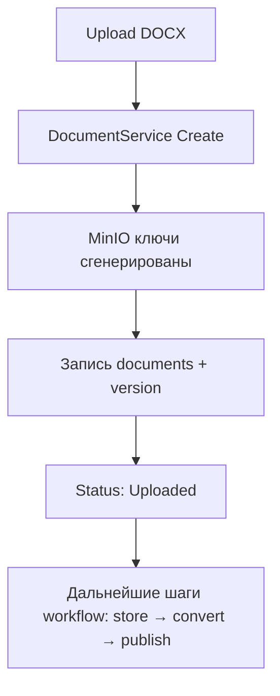
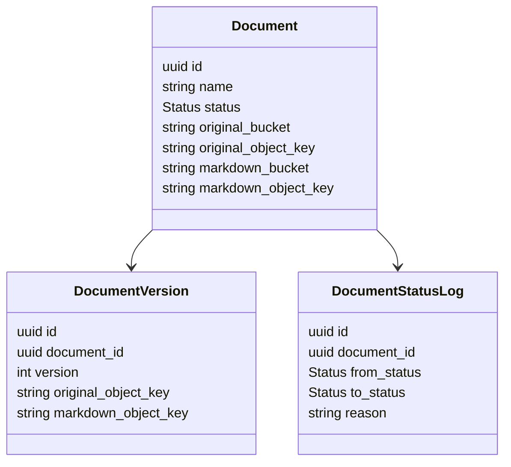

# Диаграммы

```mermaid
flowchart TD
    A[Upload DOCX] --> B[DocumentService Create]
    B --> C[MinIO ключи сгенерированы]
    C --> D[Запись documents + version]
    D --> E[Status: Uploaded]
    E --> F[Дальнейшие шаги workflow: store → convert → publish]
```

```mermaid
classDiagram
    class Document {
        uuid id
        string name
        Status status
        string original_bucket
        string original_object_key
        string markdown_bucket
        string markdown_object_key
    }
    class DocumentVersion {
        uuid id
        uuid document_id
        int version
        string original_object_key
        string markdown_object_key
    }
    class DocumentStatusLog {
        uuid id
        uuid document_id
        Status from_status
        Status to_status
        string reason
    }
    Document --> DocumentVersion
    Document --> DocumentStatusLog
```
