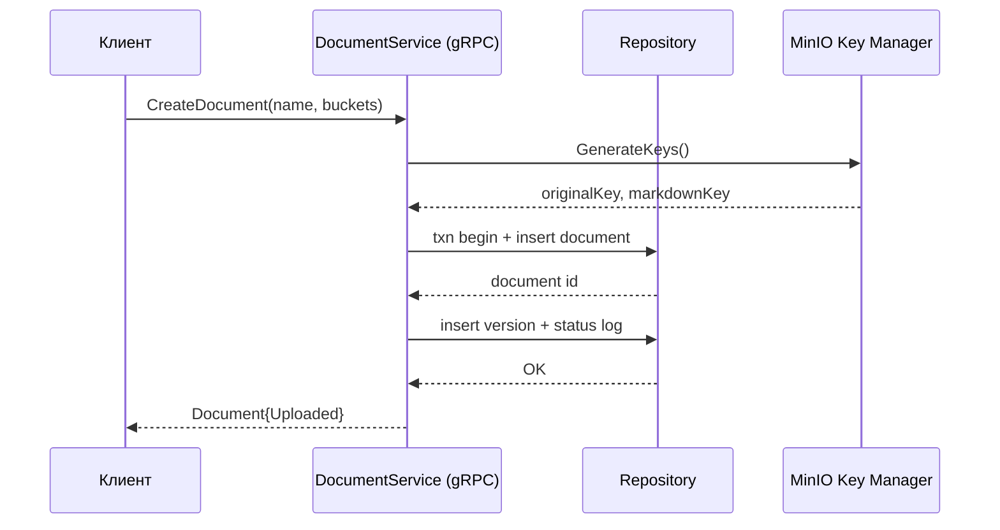

# Последовательность CreateDocument

```mermaid
sequenceDiagram
    participant C as Клиент
    participant S as DocumentService (gRPC)
    participant R as Repository
    participant M as MinIO Key Manager

    C->>S: CreateDocument(name, buckets)
    S->>M: GenerateKeys()
    M-->>S: originalKey, markdownKey
    S->>R: txn begin + insert document
    R-->>S: document id
    S->>R: insert version + status log
    R-->>S: OK
    S-->>C: Document{Uploaded}
```
