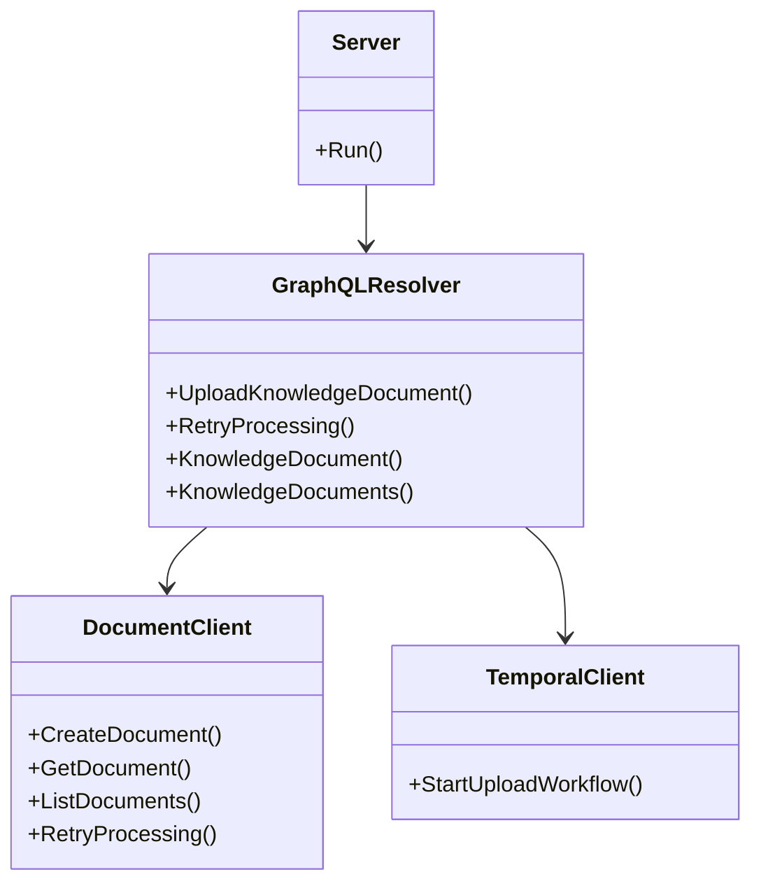

# code

```mermaid
classDiagram
    class Server {
        +Run()
    }
    class GraphQLResolver {
        +UploadKnowledgeDocument()
        +RetryProcessing()
        +KnowledgeDocument()
        +KnowledgeDocuments()
    }
    class DocumentClient {
        +CreateDocument()
        +GetDocument()
        +ListDocuments()
        +RetryProcessing()
    }
    class TemporalClient {
        +StartUploadWorkflow()
    }
    Server --> GraphQLResolver
    GraphQLResolver --> DocumentClient
    GraphQLResolver --> TemporalClient
```

