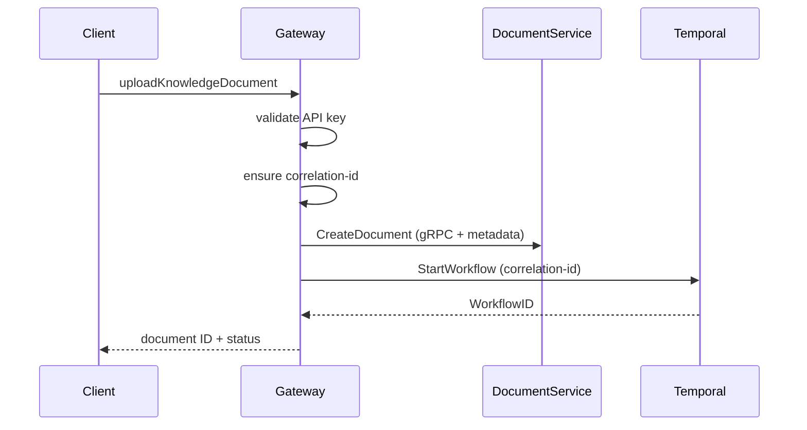

# sequence

```mermaid
sequenceDiagram
    participant Client
    participant Gateway
    participant DocumentService
    participant Temporal

    Client->>Gateway: uploadKnowledgeDocument
    Gateway->>Gateway: validate API key
    Gateway->>Gateway: ensure correlation-id
    Gateway->>DocumentService: CreateDocument (gRPC + metadata)
    Gateway->>Temporal: StartWorkflow (correlation-id)
    Temporal-->>Gateway: WorkflowID
    Gateway-->>Client: document ID + status
```

