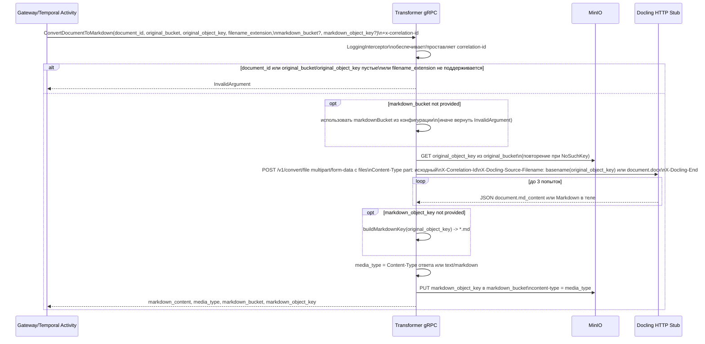

# Sequence diagram

```mermaid
sequenceDiagram
    participant GW as Gateway/Temporal Activity
    participant TR as Transformer gRPC
    participant MN as MinIO
    participant DL as Docling HTTP Stub

    GW->>TR: ConvertDocumentToMarkdown(document_id, original_bucket, original_object_key, filename_extension,\nmarkdown_bucket?, markdown_object_key?)\n+x-correlation-id
    TR->>TR: LoggingInterceptor\nобеспечивает/проставляет correlation-id
    alt document_id или original_bucket/original_object_key пустые\nили filename_extension не поддерживается
        TR-->>GW: InvalidArgument
    else
        opt markdown_bucket not provided
            TR->>TR: использовать markdownBucket из конфигурации\n(иначе вернуть InvalidArgument)
        end
        TR->>MN: GET original_object_key из original_bucket\n(повторение при NoSuchKey)
        TR->>DL: POST /v1/convert/file multipart/form-data с files\nContent-Type part: исходный\nX-Correlation-Id\nX-Docling-Source-Filename: basename(original_object_key) или document.docx\nX-Docling-Endpoint: <docling.endpoint>\nX-Api-Key при наличии
        loop до 3 попыток
            DL-->>TR: JSON document.md_content или Markdown в теле
        end
        opt markdown_object_key not provided
            TR->>TR: buildMarkdownKey(original_object_key) -> *.md
        end
        TR->>TR: media_type = Content-Type ответа или text/markdown
        TR->>MN: PUT markdown_object_key в markdown_bucket\ncontent-type = media_type
        TR-->>GW: markdown_content, media_type, markdown_bucket, markdown_object_key
    end
```
