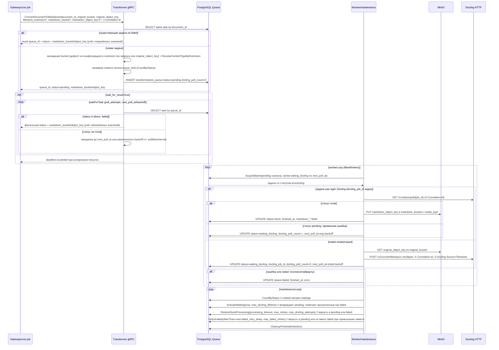
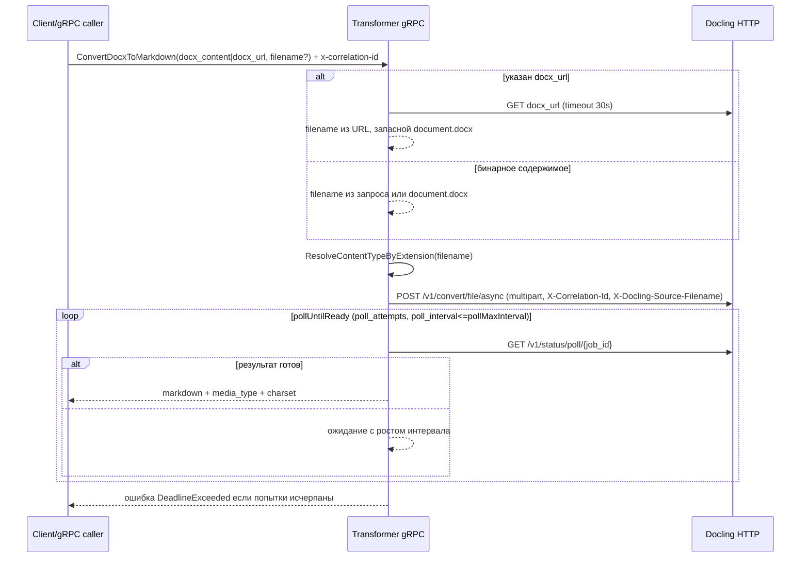

# Sequence diagram

```mermaid
sequenceDiagram
    participant GW as Gateway/cron job
    participant TR as Transformer gRPC
    participant PG as PostgreSQL Queue
    participant WK as Worker/maintenance
    participant MN as MinIO
    participant DL as Docling HTTP

    GW->>TR: ConvertDocumentToMarkdown(document_id, original_bucket, original_object_key,<br/>filename_extension?, markdown_bucket?, markdown_object_key?) + x-correlation-id
    TR->>PG: SELECT latest task by document_id
    alt существующая задача не failed
        TR-->>GW: reuse queue_id + status + markdown_bucket/object_key (учёт сохранённых значений)
    else новая задача
        TR->>TR: валидация bucket (дефолт из конфигурации) и extension (из запроса или original_object_key) + ResolveContentTypeByExtension
        TR->>TR: проверка лимита service.queue_limit (CountByStatus)
        TR->>PG: INSERT transformations_queue status=pending docling_poll_count=0
        TR-->>GW: queue_id, status=pending, markdown_bucket/object_key
    end
    opt wait_for_result=true
        loop waitForTask (poll_attempts, next_poll_at/backoff)
            TR->>PG: SELECT task by queue_id
            alt status in [done, failed]
                TR-->>GW: финальный status + markdown_bucket/object_key (учёт обновлённых значений)
            else статус не готов
                TR->>TR: ожидание до next_poll_at или увеличенного backoff (<= pollMaxInterval)
            end
        end
        TR-->>GW: deadline exceeded при исчерпании попыток
    end

    loop workerLoop (MaxWorkers)
        WK->>PG: AcquireBatch(pending сначала, затем waiting_docling по next_poll_at)
        PG-->>WK: задачи со статусом processing
        alt задача уже ждёт Docling (docling_job_id задан)
            WK->>DL: GET /v1/status/poll/{job_id} (X-Correlation-Id)
            alt статус готов
                WK->>MN: PUT markdown_object_key в markdown_bucket c media_type
                WK->>PG: UPDATE status=done, finished_at, markdown_* fields
            else статус pending / временная ошибка
                WK->>PG: UPDATE status=waiting_docling, docling_poll_count++, next_poll_at=exp.backoff
            end
        else новая конвертация
            WK->>MN: GET original_object_key из original_bucket
            WK->>DL: POST /v1/convert/file/async (multipart, X-Correlation-Id, X-Docling-Source-Filename)
            WK->>PG: UPDATE status=waiting_docling, docling_job_id, docling_poll_count=0, next_poll_at=initial backoff
        end
        alt ошибка или лимит поллинга/таймауты
            WK->>PG: UPDATE status=failed, finished_at, error
        end
    end

    loop maintenanceLoop
        WK->>PG: CountByStatus // снимок метрик очереди
        WK->>PG: ActivateWaiting(now, max_docling_lifetime) // возвращает pending, помечает просроченные как failed
        WK->>PG: RestoreStuckProcessing(processing_timeout, max_retries, max_docling_attempts) // вернуть в pending или failed
        WK->>PG: RetryFailed(olderThan=now-failed_retry_delay, max_failed_retries) // вернуть в pending или оставить failed при превышении лимита
        WK->>PG: CleanupFinished(retention)
    end
```

```mermaid
sequenceDiagram
    participant CL as Client/gRPC caller
    participant TR as Transformer gRPC
    participant DL as Docling HTTP

    CL->>TR: ConvertDocxToMarkdown(docx_content|docx_url, filename?) + x-correlation-id
    alt указан docx_url
        TR->>DL: GET docx_url (timeout 30s)
        TR-->>TR: filename из URL, запасной document.docx
    else бинарное содержимое
        TR-->>TR: filename из запроса или document.docx
    end
    TR->>TR: ResolveContentTypeByExtension(filename)
    TR->>DL: POST /v1/convert/file/async (multipart, X-Correlation-Id, X-Docling-Source-Filename)
    loop pollUntilReady (poll_attempts, poll_interval<=pollMaxInterval)
        TR->>DL: GET /v1/status/poll/{job_id}
        alt результат готов
            TR-->>CL: markdown + media_type + charset
        else
            TR-->>TR: ожидание c ростом интервала
        end
    end
    TR-->>CL: ошибка DeadlineExceeded если попытки исчерпаны
```
