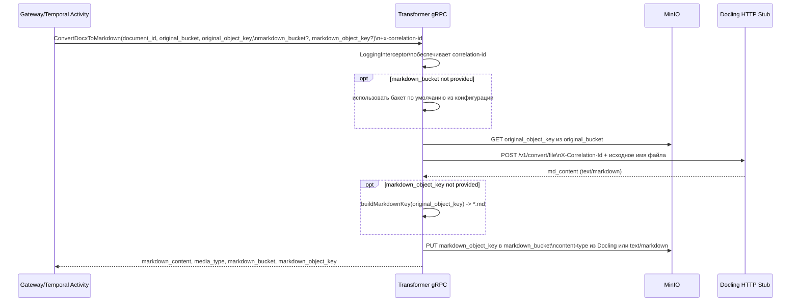

# Sequence diagram

```mermaid
sequenceDiagram
    participant GW as Gateway/Temporal Activity
    participant TR as Transformer gRPC
    participant MN as MinIO
    participant DL as Docling HTTP Stub

    GW->>TR: ConvertDocxToMarkdown(document_id, original_bucket, original_object_key,\nmarkdown_bucket?, markdown_object_key?)\n+x-correlation-id
    TR->>TR: LoggingInterceptor\nобеспечивает correlation-id
    opt markdown_bucket not provided
        TR->>TR: использовать бакет по умолчанию из конфигурации
    end
    TR->>MN: GET original_object_key из original_bucket
    TR->>DL: POST /v1/convert/file\nX-Correlation-Id + исходное имя файла
    DL-->>TR: md_content (text/markdown)
    opt markdown_object_key not provided
        TR->>TR: buildMarkdownKey(original_object_key) -> *.md
    end
    TR->>MN: PUT markdown_object_key в markdown_bucket\ncontent-type из Docling или text/markdown
    TR-->>GW: markdown_content, media_type, markdown_bucket, markdown_object_key
```
