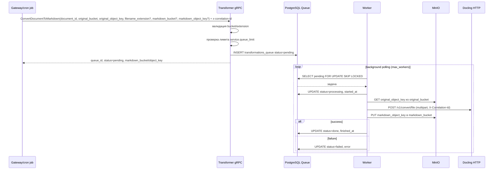

# Sequence diagram

```mermaid
sequenceDiagram
    participant GW as Gateway/cron job
    participant TR as Transformer gRPC
    participant PG as PostgreSQL Queue
    participant WK as Worker
    participant MN as MinIO
    participant DL as Docling HTTP

    GW->>TR: ConvertDocumentToMarkdown(document_id, original_bucket, original_object_key, filename_extension?, markdown_bucket?, markdown_object_key?) + x-correlation-id
    TR->>TR: валидация bucket/extension
    TR->>TR: проверка лимита service.queue_limit
    TR->>PG: INSERT transformations_queue status=pending
    TR-->>GW: queue_id, status=pending, markdown_bucket/object_key

    loop background polling (max_workers)
        WK->>PG: SELECT pending FOR UPDATE SKIP LOCKED
        PG-->>WK: задача
        WK->>PG: UPDATE status=processing, started_at
        WK->>MN: GET original_object_key из original_bucket
        WK->>DL: POST /v1/convert/file (multipart, X-Correlation-Id)
        WK->>MN: PUT markdown_object_key в markdown_bucket
        alt success
            WK->>PG: UPDATE status=done, finished_at
        else failure
            WK->>PG: UPDATE status=failed, error
        end
    end
```
