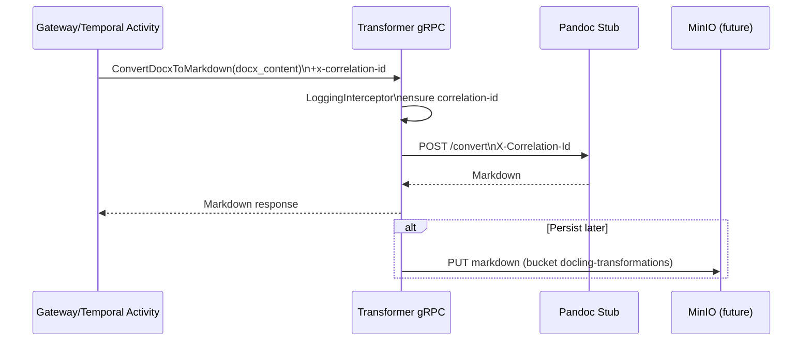

# Sequence diagram

```mermaid
sequenceDiagram
    participant GW as Gateway/Temporal Activity
    participant TR as Transformer gRPC
    participant PC as Pandoc Stub
    participant MN as MinIO (future)

    GW->>TR: ConvertDocxToMarkdown(docx_content)\n+x-correlation-id
    TR->>TR: LoggingInterceptor\nensure correlation-id
    TR->>PC: POST /convert\nX-Correlation-Id
    PC-->>TR: Markdown
    TR-->>GW: Markdown response
    alt Persist later
        TR->>MN: PUT markdown (bucket docling-transformations)
    end
```
