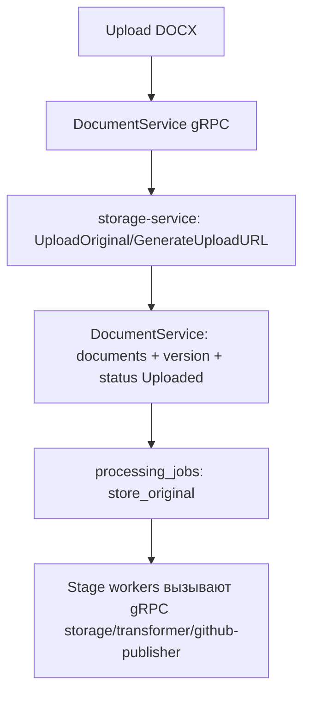
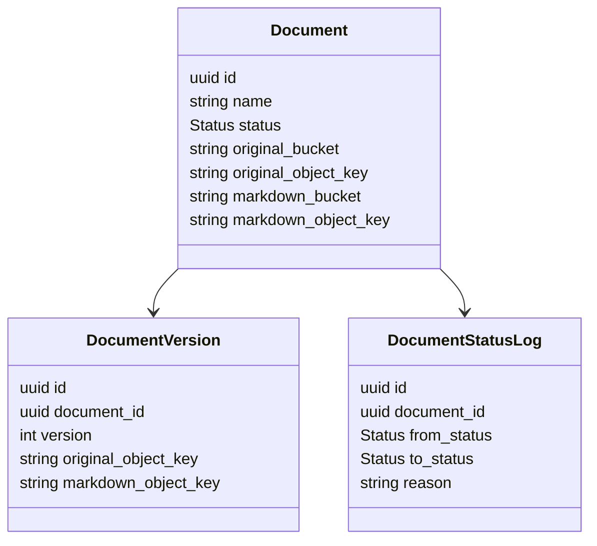
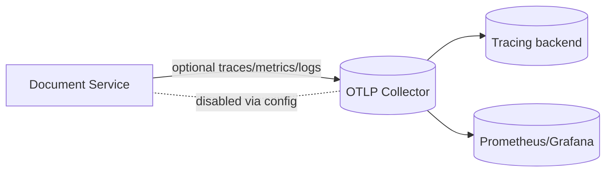

# Диаграммы

```mermaid
flowchart TD
    A[Upload DOCX] --> B[DocumentService gRPC]
    B --> C[storage-service: UploadOriginal/GenerateUploadURL]
    C --> D[DocumentService: documents + version + status Uploaded]
    D --> E[processing_jobs: store_original]
    E --> F[Stage workers вызывают gRPC storage/transformer/github-publisher]
```

```mermaid
classDiagram
    class Document {
        uuid id
        string name
        Status status
        string original_bucket
        string original_object_key
        string markdown_bucket
        string markdown_object_key
    }
    class DocumentVersion {
        uuid id
        uuid document_id
        int version
        string original_object_key
        string markdown_object_key
    }
    class DocumentStatusLog {
        uuid id
        uuid document_id
        Status from_status
        Status to_status
        string reason
    }
    Document --> DocumentVersion
    Document --> DocumentStatusLog
```

```mermaid
flowchart LR
    DS[Document Service] -- optional traces/metrics/logs --> OTLP[(OTLP Collector)]
    OTLP --> APM[(Tracing backend)]
    OTLP --> Metrics[(Prometheus/Grafana)]
    OTLP -. disabled via config .- DS
```

Трафик в OTLP Collector включается флагами `observability.traces.enabled` и `observability.metrics.enabled`; при выключенных значениях провайдеры остаются в no-op состоянии.
