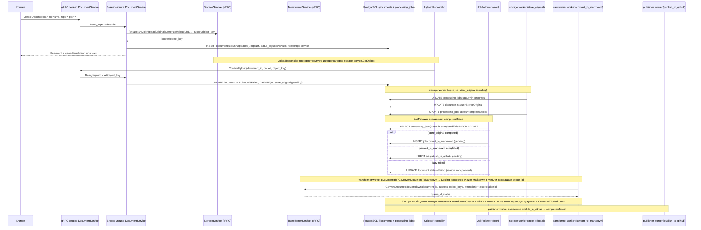

# Последовательность CreateDocument

```mermaid
sequenceDiagram
    participant C as Клиент
    participant G as gRPC сервер DocumentService
    participant S as Бизнес-логика DocumentService
    participant ST as StorageService (gRPC)
    participant TR as TransformerService (gRPC)
    participant R as PostgreSQL (documents + processing_jobs)
    participant UR as UploadReconciler
    participant F as JobFollower (cron)
    participant SW as storage worker (store_original)
    participant TW as transformer worker (convert_to_markdown)
    participant PW as publisher worker (publish_to_github)

    C->>G: CreateDocument(id?, fileName, repo?, path?)
    G->>S: Валидация + defaults
    S->>ST: (опционально) UploadOriginal/GenerateUploadURL → bucket/object_key
    ST-->>S: bucket/object_key
    S->>R: INSERT document{status=Uploaded}, версии, status_logs с ключами из storage-service
    S-->>C: Document c upload/markdown ключами

    Note over UR,ST: UploadReconciler проверяет наличие исходника через storage-service.GetObject
    UR->>G: ConfirmUpload(document_id, bucket, object_key)
    G->>S: Валидация bucket/object_key
    S->>R: UPDATE document -> Uploaded/Failed, CREATE job store_original (pending)

    Note over SW,R: storage worker берёт job=store_original (pending)
    SW->>R: UPDATE processing_jobs status=in_progress
    SW->>R: UPDATE document status=StoredOriginal
    SW->>R: UPDATE processing_jobs status=completed/failed

    Note over F,R: JobFollower опрашивает completed/failed
    F->>R: SELECT processing_jobs(status in completed/failed) FOR UPDATE
    alt store_original completed
        F->>R: INSERT job convert_to_markdown (pending)
    else convert_to_markdown completed
        F->>R: INSERT job publish_to_github (pending)
    else any failed
        F->>R: UPDATE document status=Failed (reason from payload)
    end

    Note over TW,TR: transformer worker вызывает gRPC ConvertDocumentToMarkdown → Docling-конвертер кладёт Markdown в MinIO и возвращает queue_id
    TW->>TR: ConvertDocumentToMarkdown(document_id, buckets, object_keys, extension) + x-correlation-id
    TR-->>TW: queue_id, status
    Note over TW,R: TW при необходимости ждёт появления markdown-объекта в MinIO и только после этого переводит документ в ConvertedToMarkdown
    Note over PW,R: publisher worker выполняет publish_to_github → completed/failed
```
