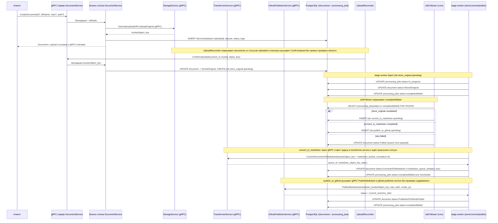

# Последовательность CreateDocument

```mermaid
sequenceDiagram
    participant C as Клиент
    participant G as gRPC сервер DocumentService
    participant S as Бизнес-логика DocumentService
    participant ST as StorageService (gRPC)
    participant TR as TransformerService (gRPC)
    participant GP as GithubPublisherService (gRPC)
    participant R as PostgreSQL (documents + processing_jobs)
    participant UR as UploadReconciler
    participant F as JobFollower (cron)
    participant SW as stage worker (store/convert/publish)

    C->>G: CreateDocument(id?, fileName, repo?, path?)
    G->>S: Валидация + defaults
    S->>ST: GenerateUploadURL/UploadOriginal (gRPC)
    ST-->>S: bucket/object_key
    S->>R: INSERT document{status=Uploaded}, версии, status_logs
    S-->>C: Document с upload ссылками и gRPC ключами

    Note over UR,ST: UploadReconciler опрашивает documents со статусом Uploaded и повторно вызывает ConfirmUpload без прямых проверок объекта
    UR->>G: ConfirmUpload(document_id, bucket, object_key)
    G->>S: Валидация bucket/object_key
    S->>R: UPDATE document -> StoredOriginal, CREATE job store_original (pending)

    Note over SW,R: stage worker берёт job=store_original (pending)
    SW->>R: UPDATE processing_jobs status=in_progress
    SW->>R: UPDATE document status=StoredOriginal
    SW->>R: UPDATE processing_jobs status=completed/failed

    Note over F,R: JobFollower опрашивает completed/failed
    F->>R: SELECT processing_jobs(status in completed/failed) FOR UPDATE
    alt store_original completed
        F->>R: INSERT job convert_to_markdown (pending)
    else convert_to_markdown completed
        F->>R: INSERT job publish_to_github (pending)
    else any failed
        F->>R: UPDATE document status=Failed (reason from payload)
    end

    Note over SW,TR: convert_to_markdown через gRPC ставит задачу в transformer-service и ждёт результата статуса
    SW->>TR: ConvertDocumentToMarkdown(bucket/object_key + markdown_bucket, correlation-id)
    TR-->>SW: queue_id, markdown_object_key, status
    SW->>R: UPDATE document status=ConvertedToMarkdown (+markdown_queue_id/object_key)
    SW->>R: UPDATE processing_jobs status=completed/failed или reschedule

    Note over SW,GP: publish_to_github вызывает gRPC PublishMarkdown в github-publisher-service без проверки содержимого
    SW->>GP: PublishMarkdown(markdown_bucket/object_key, repo, path, create_pr)
    GP-->>SW: status + commit_sha/retry_after
    SW->>R: UPDATE document status=PublishedToGitHub/Failed
    SW->>R: UPDATE processing_jobs status=completed/failed
```
