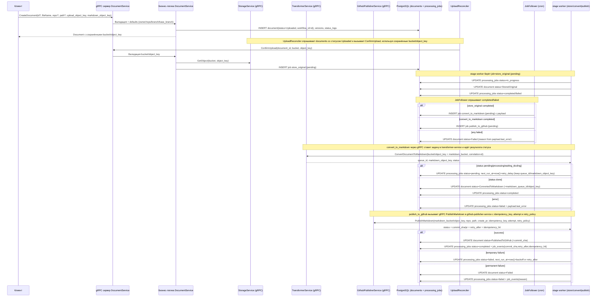

# Последовательность CreateDocument

```mermaid
sequenceDiagram
    participant C as Клиент
    participant G as gRPC сервер DocumentService
    participant S as Бизнес-логика DocumentService
    participant ST as StorageService (gRPC)
    participant TR as TransformerService (gRPC)
    participant GP as GithubPublisherService (gRPC)
    participant R as PostgreSQL (documents + processing_jobs)
    participant UR as UploadReconciler
    participant F as JobFollower (cron)
    participant SW as stage worker (store/convert/publish)

    C->>G: CreateDocument(id?, fileName, repo?, path?, upload_object_key, markdown_object_key)
    G->>S: Валидация + defaults (owner/repo/branch/base_branch)
    S->>R: INSERT document{status=Uploaded, workflow_id=id}, versions, status_logs
    S-->>C: Document с сохранёнными bucket/object_key

    Note over UR,ST: UploadReconciler опрашивает documents со статусом Uploaded и вызывает ConfirmUpload, используя сохранённые bucket/object_key
    UR->>G: ConfirmUpload(document_id, bucket, object_key)
    G->>S: Валидация bucket/object_key
    S->>ST: GetObject(bucket, object_key)
    S->>R: INSERT job store_original (pending)

    Note over SW,R: stage worker берёт job=store_original (pending)
    SW->>R: UPDATE processing_jobs status=in_progress
    SW->>R: UPDATE document status=StoredOriginal
    SW->>R: UPDATE processing_jobs status=completed/failed

    Note over F,R: JobFollower опрашивает completed/failed
    alt store_original completed
        F->>R: INSERT job convert_to_markdown (pending) с payload
    else convert_to_markdown completed
        F->>R: INSERT job publish_to_github (pending)
    else any failed
        F->>R: UPDATE document status=Failed (reason from payload.last_error)
    end

    Note over SW,TR: convert_to_markdown через gRPC ставит задачу в transformer-service и ждёт результата статуса
    SW->>TR: ConvertDocumentToMarkdown(bucket/object_key + markdown_bucket, correlation-id)
    TR-->>SW: queue_id, markdown_object_key, status
    alt status pending/processing/waiting_docling
        SW->>R: UPDATE processing_jobs status=pending, next_run_at=now()+retry_delay (keep queue_id/markdown_object_key)
    else status done
        SW->>R: UPDATE document status=ConvertedToMarkdown (+markdown_queue_id/object_key)
        SW->>R: UPDATE processing_jobs status=completed
    else error
        SW->>R: UPDATE processing_jobs status=failed + payload.last_error
    end

    Note over SW,GP: publish_to_github вызывает gRPC PublishMarkdown в github-publisher-service с idempotency_key, attempt и retry_policy
    SW->>GP: PublishMarkdown(markdown_bucket/object_key, repo, path, create_pr, idempotency_key, attempt, retry_policy)
    GP-->>SW: status + commit_sha/pr + retry_after + idempotency_hit
    alt success
        SW->>R: UPDATE document status=PublishedToGitHub (+commit_sha)
        SW->>R: UPDATE processing_jobs status=completed + job_events{commit_sha,retry_after,idempotency_hit}
    else temporary failure
        SW->>R: UPDATE processing_jobs status=failed, next_run_at=now()+backoff or retry_after
    else permanent failure
        SW->>R: UPDATE document status=Failed
        SW->>R: UPDATE processing_jobs status=failed + job_events{reason}
    end
```
