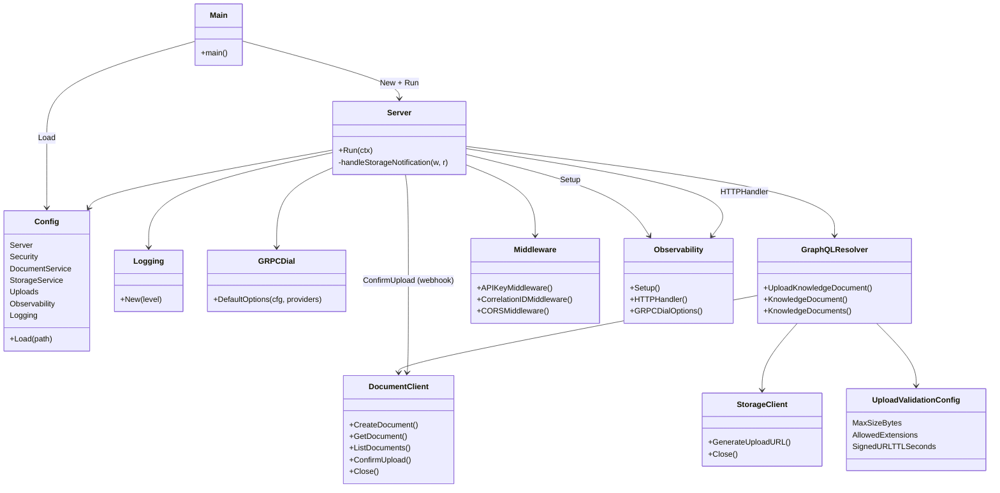

# code

```mermaid
classDiagram
    class Main {
        +main()
    }
    class Config {
        +Load(path)
        Server
        Security
        DocumentService
        StorageService
        Uploads
        Observability
        Logging
    }
    class Server {
        +Run(ctx)
        -handleStorageNotification(w, r)
    }
    class Logging {
        +New(level)
    }
    class GRPCDial {
        +DefaultOptions(cfg, providers)
    }
    class GraphQLResolver {
        +UploadKnowledgeDocument()
        +KnowledgeDocument()
        +KnowledgeDocuments()
    }
    class UploadValidationConfig {
        MaxSizeBytes
        AllowedExtensions
        SignedURLTTLSeconds
    }
    class DocumentClient {
        +CreateDocument()
        +GetDocument()
        +ListDocuments()
        +ConfirmUpload()
        +Close()
    }
    class StorageClient {
        +GenerateUploadURL()
        +Close()
    }
    class Middleware {
        +APIKeyMiddleware()
        +CorrelationIDMiddleware()
        +CORSMiddleware()
    }
    class Observability {
        +Setup()
        +HTTPHandler()
        +GRPCDialOptions()
    }
    Main --> Config : Load
    Main --> Server : New + Run
    Server --> Config
    Server --> Logging
    Server --> Observability : Setup
    Server --> GRPCDial
    Server --> GraphQLResolver
    Server --> Middleware
    Server --> Observability : HTTPHandler
    GraphQLResolver --> DocumentClient
    GraphQLResolver --> StorageClient
    Server --> DocumentClient : ConfirmUpload (webhook)
    GraphQLResolver --> UploadValidationConfig
```

