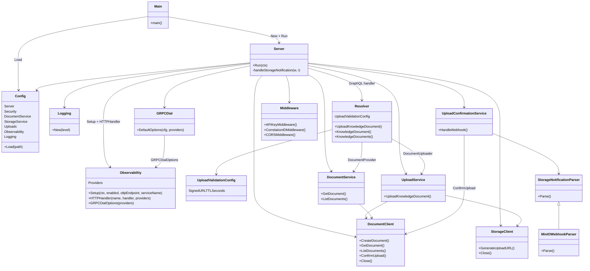

# code

```mermaid
classDiagram
    class Main {
        +main()
    }
    class Config {
        +Load(path)
        Server
        Security
        DocumentService
        StorageService
        Uploads
        Observability
        Logging
    }
    class Server {
        +Run(ctx)
        -handleStorageNotification(w, r)
    }
    class Logging {
        +New(level)
    }
    class Observability {
        +Setup(ctx, enabled, otlpEndpoint, serviceName)
        +HTTPHandler(name, handler, providers)
        +GRPCDialOptions(providers)
        Providers
    }
    class GRPCDial {
        +DefaultOptions(cfg, providers)
    }
    class Resolver {
        +UploadKnowledgeDocument()
        +KnowledgeDocument()
        +KnowledgeDocuments()
        UploadValidationConfig
    }
    class UploadValidationConfig {
        SignedURLTTLSeconds
    }
    class UploadService {
        +UploadKnowledgeDocument()
    }
    class DocumentService {
        +GetDocument()
        +ListDocuments()
    }
    class UploadConfirmationService {
        +HandleWebhook()
    }
    class DocumentClient {
        +CreateDocument()
        +GetDocument()
        +ListDocuments()
        +ConfirmUpload()
        +Close()
    }
    class StorageClient {
        +GenerateUploadURL()
        +Close()
    }
    class StorageNotificationParser {
        +Parse()
    }
    class MinIOWebhookParser {
        +Parse()
    }
    class Middleware {
        +APIKeyMiddleware()
        +CorrelationIDMiddleware()
        +CORSMiddleware()
    }
    Main --> Config : Load
    Main --> Server : New + Run
    Server --> Config
    Server --> Logging
    Server --> Observability : Setup + HTTPHandler
    Server --> GRPCDial
    Server --> DocumentClient
    Server --> StorageClient
    Server --> UploadService
    Server --> DocumentService
    Server --> UploadConfirmationService
    Server --> Middleware
    Server --> Resolver : GraphQL handler
    Resolver --> UploadService : DocumentUploader
    Resolver --> DocumentService : DocumentProvider
    Resolver --> UploadValidationConfig
    UploadService --> DocumentClient
    UploadService --> StorageClient
    DocumentService --> DocumentClient
    UploadConfirmationService --> StorageNotificationParser
    UploadConfirmationService --> DocumentClient : ConfirmUpload
    StorageNotificationParser <|-- MinIOWebhookParser
    GRPCDial --> Observability : GRPCDialOptions
```
