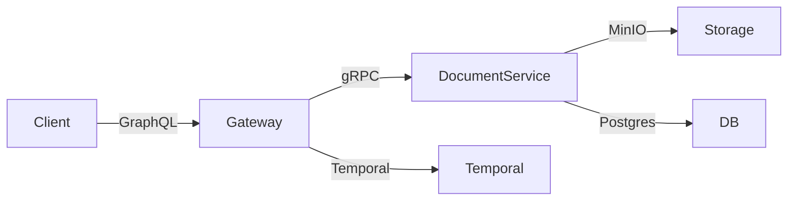

# diagrams

```mermaid
flowchart LR
    Client -->|GraphQL| Gateway
    Gateway -->|gRPC| DocumentService
    Gateway -->|Temporal| Temporal
    DocumentService -->|MinIO| Storage
    DocumentService -->|Postgres| DB
```

- OTLP-коллектор показан отдельно: при `observability.enabled=false` сервис не создаёт экспортеры и работает с no-op провайдерами/хендлерами.

