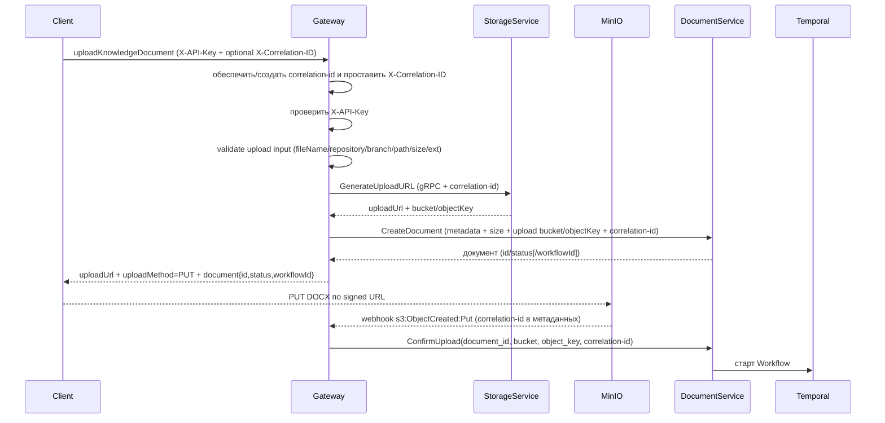

# sequence

```mermaid
sequenceDiagram
    participant Client
    participant Gateway
    participant StorageService
    participant MinIO
    participant DocumentService
    participant Temporal

    Client->>Gateway: uploadKnowledgeDocument (X-API-Key + optional X-Correlation-ID)
    Gateway->>Gateway: обеспечить/создать correlation-id и проставить X-Correlation-ID
    Gateway->>Gateway: проверить X-API-Key
    Gateway->>Gateway: validate upload input (fileName/repository/branch/path/size/ext)
    Gateway->>StorageService: GenerateUploadURL (gRPC + correlation-id)
    StorageService-->>Gateway: uploadUrl + bucket/objectKey
    Gateway->>DocumentService: CreateDocument (metadata + size + upload bucket/objectKey + correlation-id)
    DocumentService-->>Gateway: документ (id/status[/workflowId])
    Gateway-->>Client: uploadUrl + uploadMethod=PUT + document{id,status,workflowId}
    Client-->>MinIO: PUT DOCX по signed URL
    MinIO-->>Gateway: webhook s3:ObjectCreated:Put (correlation-id в метаданных)
    Gateway->>DocumentService: ConfirmUpload(document_id, bucket, object_key, correlation-id)
    DocumentService->>Temporal: старт Workflow
```

