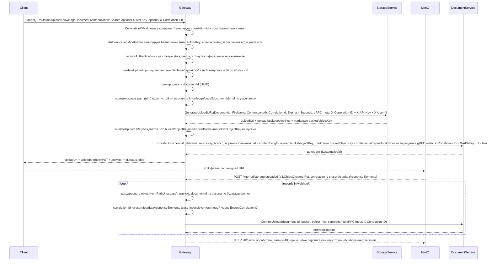

# sequence

```mermaid
sequenceDiagram
    participant Client
    participant Gateway
    participant StorageService
    participant MinIO
    participant DocumentService

    Client->>Gateway: GraphQL mutation uploadKnowledgeDocument (Authorization: Bearer, optional X-API-Key, optional X-Correlation-ID)
    Gateway->>Gateway: CorrelationIDMiddleware сохраняет/генерирует correlation-id и проставляет его в ответ
    Gateway->>Gateway: AuthenticationMiddleware валидирует bearer токен (или X-API-Key, если включён) и сохраняет его в контексте
    Gateway->>Gateway: requireAuthentication в резолвере убеждается, что аутентификация есть в контексте
    Gateway->>Gateway: validateUploadInput проверяет, что fileName/repository/branch непустые и fileSizeBytes > 0
    Gateway->>Gateway: сгенерировать documentId (UUID)
    Gateway->>Gateway: нормализовать path (trim) если пустой — выставить knowledge/docs/{documentId}.md по умолчанию
    Gateway->>StorageService: GenerateUploadURL(DocumentId, FileName, ContentLength, CorrelationId, ExpiresInSeconds, gRPC meta: X-Correlation-ID + X-API-Key + X-User-*)
    StorageService-->>Gateway: uploadUrl + upload bucket/objectKey + markdown bucket/objectKey
    Gateway->>Gateway: validateUploadURL убеждается, что bucket/objectKey/markdownBucket/markdownObjectKey не пустые
    Gateway->>DocumentService: CreateDocument(id, fileName, repository, branch, нормализованный path, contentLength, upload bucket/objectKey, markdown bucket/objectKey, correlation-id repositoryOwner не передается gRPC meta: X-Correlation-ID + X-API-Key + X-User-*)
    DocumentService-->>Gateway: документ (id/status/jobId)
    Gateway-->>Client: uploadUrl + uploadMethod=PUT + документ{id,status,jobId}
    Client-->>MinIO: PUT файла по presigned URL
    MinIO-->>Gateway: POST /internal/storage/uploaded (s3:ObjectCreated:Put, correlation-id в userMetadata/responseElements)
    loop records in webhook
        Gateway->>Gateway: декодировать objectKey (PathUnescape), извлечь documentId из basename без расширения
        Gateway->>Gateway: correlation-id из userMetadata/responseElements (case-insensitive) или новый через EnsureCorrelationID
        Gateway->>DocumentService: ConfirmUpload(document_id, bucket, object_key, correlation-id gRPC meta: X-Correlation-ID)
        DocumentService-->>Gateway: подтверждение
    end
    Gateway-->>MinIO: HTTP 202 если обработаны записи 400 при ошибке парсинга или отсутствии обработанных записей
```
