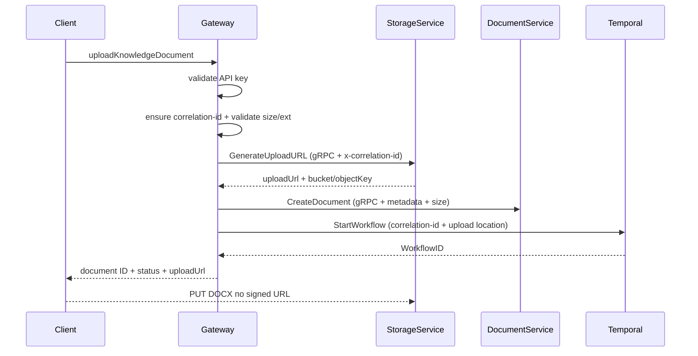

# sequence

```mermaid
sequenceDiagram
    participant Client
    participant Gateway
    participant StorageService
    participant DocumentService
    participant Temporal

    Client->>Gateway: uploadKnowledgeDocument
    Gateway->>Gateway: validate API key
    Gateway->>Gateway: ensure correlation-id + validate size/ext
    Gateway->>StorageService: GenerateUploadURL (gRPC + x-correlation-id)
    StorageService-->>Gateway: uploadUrl + bucket/objectKey
    Gateway->>DocumentService: CreateDocument (gRPC + metadata + size)
    Gateway->>Temporal: StartWorkflow (correlation-id + upload location)
    Temporal-->>Gateway: WorkflowID
    Gateway-->>Client: document ID + status + uploadUrl
    Client-->>StorageService: PUT DOCX по signed URL
```

