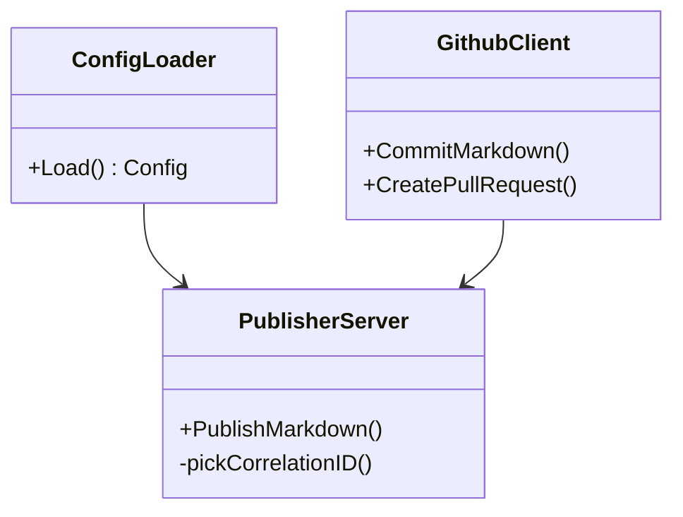

# Code view

```mermaid
classDiagram
    class ConfigLoader {
      +Load() Config
    }
    class GithubClient {
      +CommitMarkdown()
      +CreatePullRequest()
    }
    class PublisherServer {
      +PublishMarkdown()
      -pickCorrelationID()
    }
    ConfigLoader --> PublisherServer
    GithubClient --> PublisherServer
```
