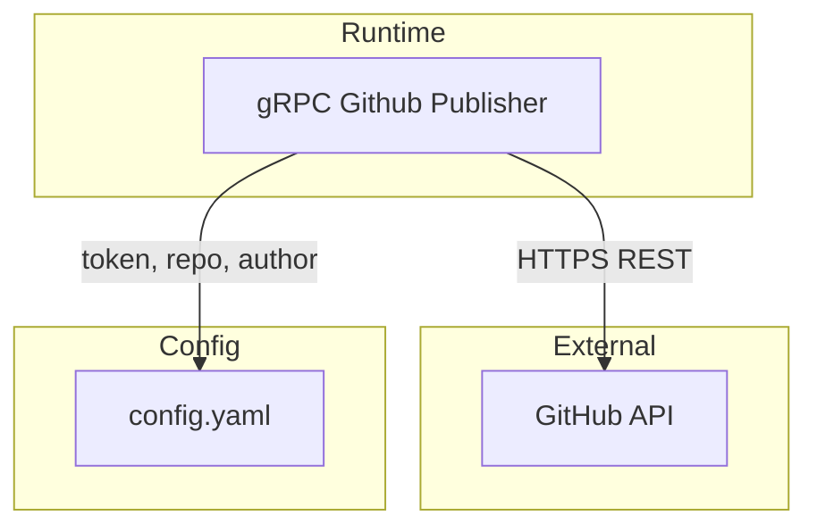

# Infrastructure

```mermaid
graph TD
  subgraph Runtime
    A[gRPC Github Publisher]
  end
  subgraph External
    B[GitHub API]
  end
  subgraph Config
    C[config.yaml]
  end

  A -- token, repo, author --> C
  A -- HTTPS REST --> B
```
