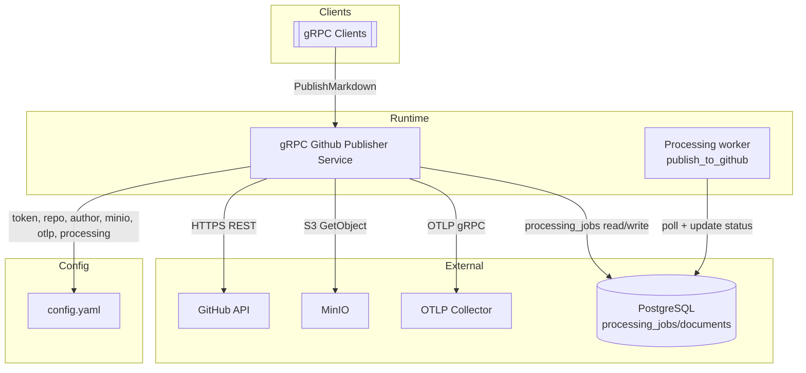

# Infrastructure

```mermaid
graph TD
  subgraph Runtime
    A[gRPC Github Publisher Service]
    W[Processing worker\npublish_to_github]
  end
  subgraph External
    B[GitHub API]
    C[MinIO]
    D[OTLP Collector]
    DB[(PostgreSQL\nprocessing_jobs/documents)]
  end
  subgraph Config
    E[config.yaml]
  end
  subgraph Clients
    F[[gRPC Clients]]
  end

  F -->|PublishMarkdown| A
  A -- token, repo, author, minio, otlp, processing --> E
  A -- HTTPS REST --> B
  A -- S3 GetObject --> C
  A -- processing_jobs read/write --> DB
  W -- poll + update status --> DB
  A -- OTLP gRPC --> D
```
