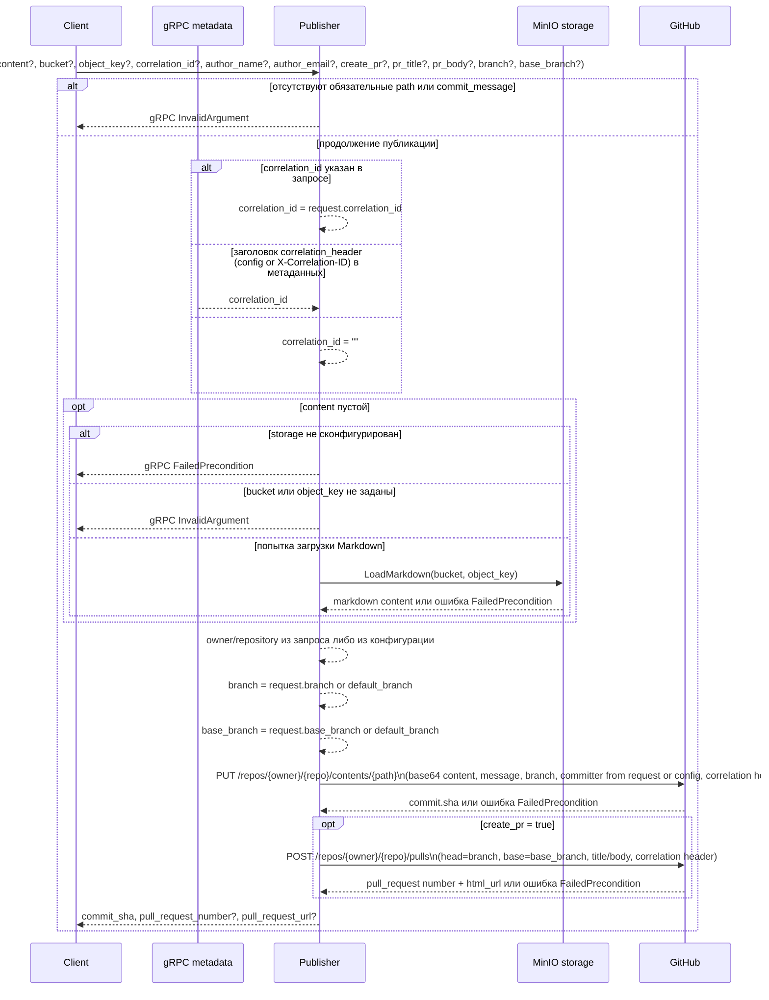

# Sequence

```mermaid
sequenceDiagram
    participant Client
    participant Metadata as gRPC metadata
    participant Publisher
    participant Storage as MinIO storage
    participant GitHub

    Client->>Publisher: PublishMarkdown(path, commit_message, content?, bucket?, object_key?, correlation_id?, author_name?, author_email?, create_pr?, pr_title?, pr_body?, branch?, base_branch?)
    alt отсутствуют обязательные path или commit_message
        Publisher-->>Client: gRPC InvalidArgument
    else продолжение публикации
        alt correlation_id указан в запросе
            Publisher-->>Publisher: correlation_id = request.correlation_id
        else заголовок correlation_header (config or X-Correlation-ID) в метаданных
            Metadata-->>Publisher: correlation_id
        else
            Publisher-->>Publisher: correlation_id = ""
        end
        opt content пустой
            alt storage не сконфигурирован
                Publisher-->>Client: gRPC FailedPrecondition
            else bucket или object_key не заданы
                Publisher-->>Client: gRPC InvalidArgument
            else попытка загрузки Markdown
                Publisher->>Storage: LoadMarkdown(bucket, object_key)
                Storage-->>Publisher: markdown content или ошибка FailedPrecondition
            end
        end
        Publisher-->>Publisher: owner/repository из запроса либо из конфигурации
        Publisher-->>Publisher: branch = request.branch or default_branch
        Publisher-->>Publisher: base_branch = request.base_branch or default_branch
        Publisher->>GitHub: PUT /repos/{owner}/{repo}/contents/{path}\n(base64 content, message, branch, committer from request or config, correlation header)
        GitHub-->>Publisher: commit.sha или ошибка FailedPrecondition
        opt create_pr = true
            Publisher->>GitHub: POST /repos/{owner}/{repo}/pulls\n(head=branch, base=base_branch, title/body, correlation header)
            GitHub-->>Publisher: pull_request number + html_url или ошибка FailedPrecondition
        end
        Publisher-->>Client: commit_sha, pull_request_number?, pull_request_url?
    end
```
