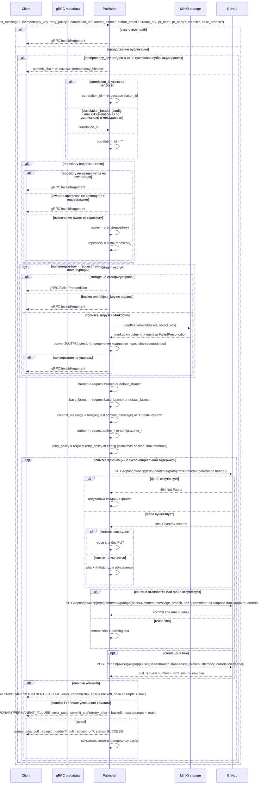

# Sequence

```mermaid
sequenceDiagram
    participant Client
    participant Metadata as gRPC metadata
    participant Publisher
    participant Storage as MinIO storage
    participant GitHub

    Client->>Publisher: PublishMarkdown(path, content?/bucket+object_key?, commit_message?, idempotency_key, retry_policy?, correlation_id?, author_name?, author_email?, create_pr?, pr_title?, pr_body?, branch?, base_branch?)
    alt отсутствует path
        Publisher-->>Client: gRPC InvalidArgument
    else продолжение публикации
        alt idempotency_key найден в кэше (успешная публикация ранее)
            Publisher-->>Client: commit_sha + pr ссылки, idempotency_hit=true
        else
            alt correlation_id указан в запросе
                Publisher-->>Publisher: correlation_id = request.correlation_id
            else correlation_header (config или X-Correlation-ID по умолчанию) в метаданных
                Metadata-->>Publisher: correlation_id
            else
                Publisher-->>Publisher: correlation_id = ""
            end
            alt repository содержит слэш
                alt repository не разделяется на owner/repo
                    Publisher-->>Client: gRPC InvalidArgument
                else owner в префиксе не совпадает с request.owner
                    Publisher-->>Client: gRPC InvalidArgument
                else извлечение owner из repository
                    Publisher-->>Publisher: owner = prefix(repository)
                    Publisher-->>Publisher: repository = suffix(repository)
                end
            else owner/repository = request.* или из конфигурации
            end
            opt content пустой
                alt storage не сконфигурирован
                    Publisher-->>Client: gRPC FailedPrecondition
                else bucket или object_key не заданы
                    Publisher-->>Client: gRPC InvalidArgument
                else попытка загрузки Markdown
                    Publisher->>Storage: LoadMarkdown(bucket, object_key)
                    Storage-->>Publisher: markdown bytes или ошибка FailedPrecondition
                    Publisher-->>Publisher: convertToUTF8(bytes)\n(определение кодировки через charsetautodetect)
                    alt конвертация не удалась
                        Publisher-->>Client: gRPC InvalidArgument
                    end
                end
            end
            Publisher-->>Publisher: branch = request.branch or default_branch
            Publisher-->>Publisher: base_branch = request.base_branch or default_branch
            Publisher-->>Publisher: commit_message = trim(request.commit_message) or "Update <path>"
            Publisher-->>Publisher: author = request.author_* or config.author_*
            Publisher-->>Publisher: retry_policy = request.retry_policy or config (initial/max backoff, max attempts)
            loop попытка публикации с экспоненциальной задержкой
                Publisher->>GitHub: GET /repos/{owner}/{repo}/contents/{path}?ref=branch\n(correlation header)
                alt файл отсутствует
                    GitHub-->>Publisher: 404 Not Found
                    Publisher-->>Publisher: подготовка создания файла
                else файл существует
                    GitHub-->>Publisher: sha + base64 content
                    alt контент совпадает
                        Publisher-->>Publisher: reuse sha без PUT
                    else контент отличается
                        Publisher-->>Publisher: sha + If-Match для обновления
                    end
                end
                alt контент отличается или файл отсутствует
                    Publisher->>GitHub: PUT /repos/{owner}/{repo}/contents/{path}\n(base64 content, message, branch, sha?, committer из запроса или конфига, correlation header)
                    GitHub-->>Publisher: commit.sha или ошибка
                else reuse sha
                    Publisher-->>Publisher: commit.sha = existing.sha
                end
                opt create_pr = true
                    Publisher->>GitHub: POST /repos/{owner}/{repo}/pulls\n(head=branch, base=base_branch, title/body, correlation header)
                    GitHub-->>Publisher: pull_request number + html_url или ошибка
                end
                alt ошибка коммита
                    Publisher-->>Client: status=TEMPORARY/PERMANENT_FAILURE, error_code\n(retry_after = backoff, пока attempts < max)
                else ошибка PR после успешного коммита
                    Publisher-->>Client: status=TEMPORARY/PERMANENT_FAILURE, error_code, commit_sha\n(retry_after = backoff, пока attempts < max)
                else успех
                    Publisher-->>Client: commit_sha, pull_request_number?, pull_request_url?, status=SUCCESS
                    Publisher-->>Publisher: сохранить ответ в idempotency cache
                end
            end
        end
    end
```
