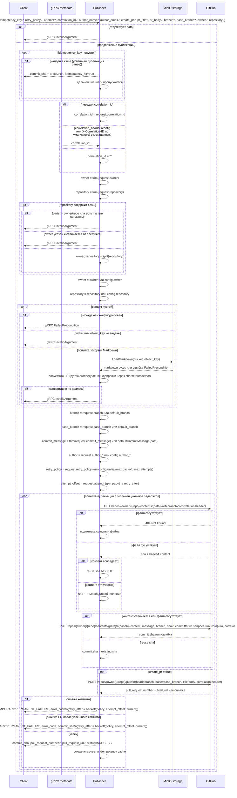

# Sequence

```mermaid
sequenceDiagram
    participant Client
    participant Metadata as gRPC metadata
    participant Publisher
    participant Storage as MinIO storage
    participant GitHub

    Client->>Publisher: PublishMarkdown(path, content?/bucket+object_key?, commit_message?, idempotency_key?, retry_policy?, attempt?, correlation_id?, author_name?, author_email?, create_pr?, pr_title?, pr_body?, branch?, base_branch?, owner?, repository?)
    alt отсутствует path
        Publisher-->>Client: gRPC InvalidArgument
    else продолжение публикации
        opt idempotency_key непустой
            alt найден в кэше (успешная публикация ранее)
                Publisher-->>Client: commit_sha + pr ссылки, idempotency_hit=true
                Publisher-->>Publisher: дальнейшие шаги пропускаются
            end
        end
        alt передан correlation_id
            Publisher-->>Publisher: correlation_id = request.correlation_id
        else correlation_header (config или X-Correlation-ID по умолчанию) в метаданных
            Metadata-->>Publisher: correlation_id
        else
            Publisher-->>Publisher: correlation_id = ""
        end
        Publisher-->>Publisher: owner = trim(request.owner)
        Publisher-->>Publisher: repository = trim(request.repository)
        alt repository содержит слэш
            alt parts != owner/repo или есть пустые сегменты
                Publisher-->>Client: gRPC InvalidArgument
            else owner указан и отличается от префикса
                Publisher-->>Client: gRPC InvalidArgument
            else
                Publisher-->>Publisher: owner, repository = split(repository)
            end
        end
        Publisher-->>Publisher: owner = owner или config.owner
        Publisher-->>Publisher: repository = repository или config.repository
        alt content пустой
            alt storage не сконфигурирован
                Publisher-->>Client: gRPC FailedPrecondition
            else bucket или object_key не заданы
                Publisher-->>Client: gRPC InvalidArgument
            else попытка загрузки Markdown
                Publisher->>Storage: LoadMarkdown(bucket, object_key)
                Storage-->>Publisher: markdown bytes или ошибка FailedPrecondition
                Publisher-->>Publisher: convertToUTF8(bytes)\n(определение кодировки через charsetautodetect)
                alt конвертация не удалась
                    Publisher-->>Client: gRPC InvalidArgument
                end
            end
        end
        Publisher-->>Publisher: branch = request.branch или default_branch
        Publisher-->>Publisher: base_branch = request.base_branch или default_branch
        Publisher-->>Publisher: commit_message = trim(request.commit_message) или defaultCommitMessage(path)
        Publisher-->>Publisher: author = request.author_* или config.author_*
        Publisher-->>Publisher: retry_policy = request.retry_policy или config (initial/max backoff, max attempts)
        Publisher-->>Publisher: attempt_offset = request.attempt (для расчёта retry_after)
        loop попытка публикации с экспоненциальной задержкой
            Publisher->>GitHub: GET /repos/{owner}/{repo}/contents/{path}?ref=branch\n(correlation header)
            alt файл отсутствует
                GitHub-->>Publisher: 404 Not Found
                Publisher-->>Publisher: подготовка создания файла
            else файл существует
                GitHub-->>Publisher: sha + base64 content
                alt контент совпадает
                    Publisher-->>Publisher: reuse sha без PUT
                else контент отличается
                    Publisher-->>Publisher: sha + If-Match для обновления
                end
            end
            alt контент отличается или файл отсутствует
                Publisher->>GitHub: PUT /repos/{owner}/{repo}/contents/{path}\n(base64 content, message, branch, sha?, committer из запроса или конфига, correlation header)
                GitHub-->>Publisher: commit.sha или ошибка
            else reuse sha
                Publisher-->>Publisher: commit.sha = existing.sha
            end
            opt create_pr = true
                Publisher->>GitHub: POST /repos/{owner}/{repo}/pulls\n(head=branch, base=base_branch, title/body, correlation header)
                GitHub-->>Publisher: pull_request number + html_url или ошибка
            end
            alt ошибка коммита
                Publisher-->>Client: status=TEMPORARY/PERMANENT_FAILURE, error_code\n(retry_after = backoff(policy, attempt_offset+current))
            else ошибка PR после успешного коммита
                Publisher-->>Client: status=TEMPORARY/PERMANENT_FAILURE, error_code, commit_sha\n(retry_after = backoff(policy, attempt_offset+current))
            else успех
                Publisher-->>Client: commit_sha, pull_request_number?, pull_request_url?, status=SUCCESS
                Publisher-->>Publisher: сохранить ответ в idempotency cache
            end
        end
    end
```
