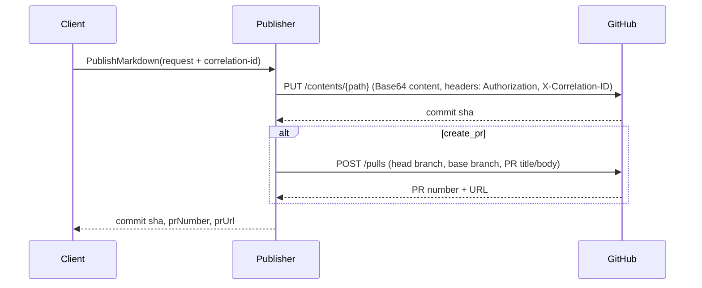

# Sequence

```mermaid
sequenceDiagram
    participant Client
    participant Publisher
    participant GitHub

    Client->>Publisher: PublishMarkdown(request + correlation-id)
    Publisher->>GitHub: PUT /contents/{path} (Base64 content, headers: Authorization, X-Correlation-ID)
    GitHub-->>Publisher: commit sha
    alt create_pr
        Publisher->>GitHub: POST /pulls (head branch, base branch, PR title/body)
        GitHub-->>Publisher: PR number + URL
    end
    Publisher-->>Client: commit sha, prNumber, prUrl
```
