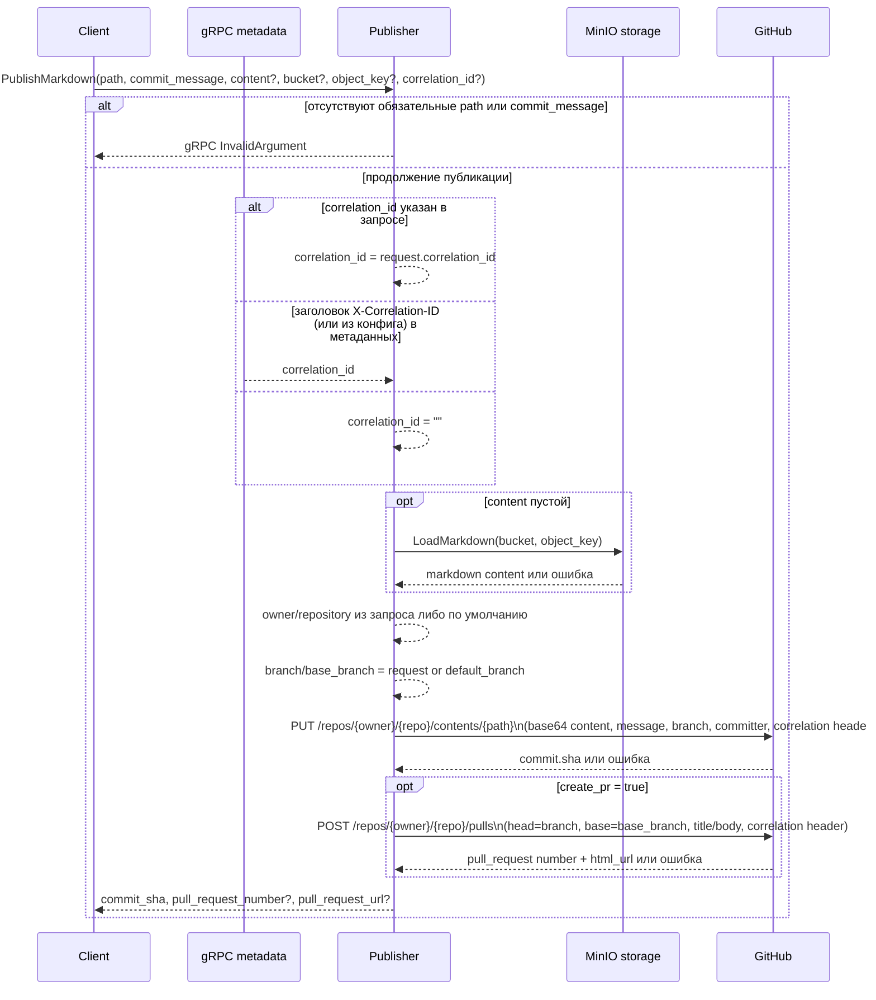

# Sequence

```mermaid
sequenceDiagram
    participant Client
    participant Metadata as gRPC metadata
    participant Publisher
    participant Storage as MinIO storage
    participant GitHub

    Client->>Publisher: PublishMarkdown(path, commit_message, content?, bucket?, object_key?, correlation_id?)
    alt отсутствуют обязательные path или commit_message
        Publisher-->>Client: gRPC InvalidArgument
    else продолжение публикации
        alt correlation_id указан в запросе
            Publisher-->>Publisher: correlation_id = request.correlation_id
        else заголовок X-Correlation-ID (или из конфига) в метаданных
            Metadata-->>Publisher: correlation_id
        else
            Publisher-->>Publisher: correlation_id = ""
        end
        opt content пустой
            Publisher->>Storage: LoadMarkdown(bucket, object_key)
            Storage-->>Publisher: markdown content или ошибка
        end
        Publisher-->>Publisher: owner/repository из запроса либо по умолчанию
        Publisher-->>Publisher: branch/base_branch = request or default_branch
        Publisher->>GitHub: PUT /repos/{owner}/{repo}/contents/{path}\n(base64 content, message, branch, committer, correlation header)
        GitHub-->>Publisher: commit.sha или ошибка
        opt create_pr = true
            Publisher->>GitHub: POST /repos/{owner}/{repo}/pulls\n(head=branch, base=base_branch, title/body, correlation header)
            GitHub-->>Publisher: pull_request number + html_url или ошибка
        end
        Publisher-->>Client: commit_sha, pull_request_number?, pull_request_url?
    end
```
