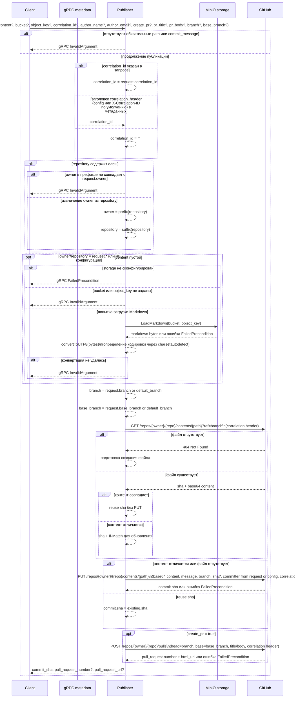

# Sequence

```mermaid
sequenceDiagram
    participant Client
    participant Metadata as gRPC metadata
    participant Publisher
    participant Storage as MinIO storage
    participant GitHub

    Client->>Publisher: PublishMarkdown(path, commit_message, content?, bucket?, object_key?, correlation_id?, author_name?, author_email?, create_pr?, pr_title?, pr_body?, branch?, base_branch?)
    alt отсутствуют обязательные path или commit_message
        Publisher-->>Client: gRPC InvalidArgument
    else продолжение публикации
        alt correlation_id указан в запросе
            Publisher-->>Publisher: correlation_id = request.correlation_id
        else заголовок correlation_header (config или X-Correlation-ID по умолчанию) в метаданных
            Metadata-->>Publisher: correlation_id
        else
            Publisher-->>Publisher: correlation_id = ""
        end
        alt repository содержит слэш
            alt owner в префиксе не совпадает с request.owner
                Publisher-->>Client: gRPC InvalidArgument
            else извлечение owner из repository
                Publisher-->>Publisher: owner = prefix(repository)
                Publisher-->>Publisher: repository = suffix(repository)
            end
        else owner/repository = request.* или из конфигурации
        end
        opt content пустой
            alt storage не сконфигурирован
                Publisher-->>Client: gRPC FailedPrecondition
            else bucket или object_key не заданы
                Publisher-->>Client: gRPC InvalidArgument
            else попытка загрузки Markdown
                Publisher->>Storage: LoadMarkdown(bucket, object_key)
                Storage-->>Publisher: markdown bytes или ошибка FailedPrecondition
                Publisher-->>Publisher: convertToUTF8(bytes)\n(определение кодировки через charsetautodetect)
                alt конвертация не удалась
                    Publisher-->>Client: gRPC InvalidArgument
                end
            end
        end
        Publisher-->>Publisher: branch = request.branch or default_branch
        Publisher-->>Publisher: base_branch = request.base_branch or default_branch
        Publisher->>GitHub: GET /repos/{owner}/{repo}/contents/{path}?ref=branch\n(correlation header)
        alt файл отсутствует
            GitHub-->>Publisher: 404 Not Found
            Publisher-->>Publisher: подготовка создания файла
        else файл существует
            GitHub-->>Publisher: sha + base64 content
            alt контент совпадает
                Publisher-->>Publisher: reuse sha без PUT
            else контент отличается
                Publisher-->>Publisher: sha + If-Match для обновления
            end
        end
        alt контент отличается или файл отсутствует
            Publisher->>GitHub: PUT /repos/{owner}/{repo}/contents/{path}\n(base64 content, message, branch, sha?, committer from request or config, correlation header)
            GitHub-->>Publisher: commit.sha или ошибка FailedPrecondition
        else reuse sha
            Publisher-->>Publisher: commit.sha = existing.sha
        end
        opt create_pr = true
            Publisher->>GitHub: POST /repos/{owner}/{repo}/pulls\n(head=branch, base=base_branch, title/body, correlation header)
            GitHub-->>Publisher: pull_request number + html_url или ошибка FailedPrecondition
        end
        Publisher-->>Client: commit_sha, pull_request_number?, pull_request_url?
    end
```
