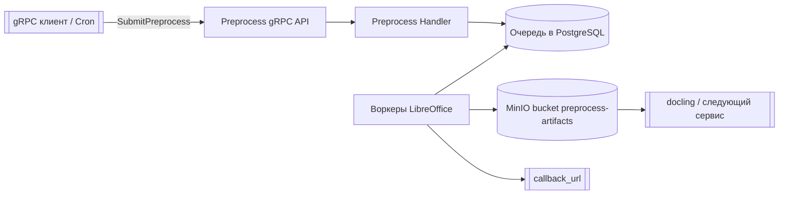
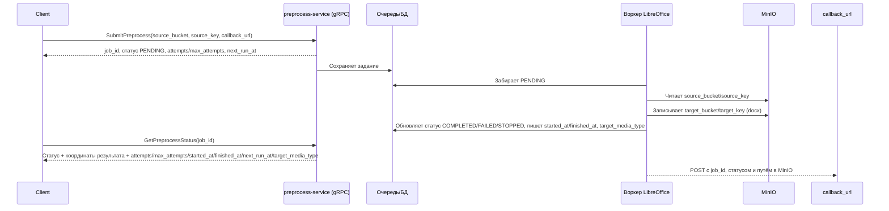

# Диаграммы сервиса

## Компоненты

```mermaid
flowchart LR
    Client[[gRPC клиент / Cron]] -->|SubmitPreprocess| GRPC[Preprocess gRPC API]
    GRPC --> Handler[Preprocess Handler]
    Handler --> Repo[(Очередь в PostgreSQL)]
    Worker[Воркеры LibreOffice] --> Repo
    Worker --> MinIO[(MinIO bucket preprocess-artifacts)]
    Worker --> Callback[[callback_url]]
    MinIO --> Downstream[[docling / следующий сервис]]
```

## Последовательность Submit → очередь → воркер → MinIO → callback

```mermaid
sequenceDiagram
    participant Client
    participant GRPC as preprocess-service (gRPC)
    participant Queue as Очередь/БД
    participant Worker as Воркер LibreOffice
    participant MinIO
    participant Callback as callback_url

    Client->>GRPC: SubmitPreprocess(source_bucket, source_key, callback_url)
    GRPC-->>Client: job_id, статус PENDING, attempts/max_attempts, next_run_at
    GRPC->>Queue: Сохраняет задание
    Worker->>Queue: Забирает PENDING
    Worker->>MinIO: Читает source_bucket/source_key
    Worker->>MinIO: Записывает target_bucket/target_key (docx)
    Worker->>Queue: Обновляет статус COMPLETED/FAILED/STOPPED, пишет started_at/finished_at, target_media_type
    Client->>GRPC: GetPreprocessStatus(job_id)
    GRPC-->>Client: Статус + координаты результата + attempts/max_attempts/started_at/finished_at/next_run_at/target_media_type
    Worker-->>Callback: POST с job_id, статусом и путём в MinIO
```
