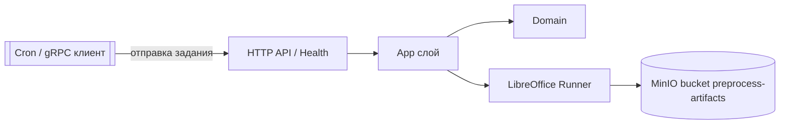
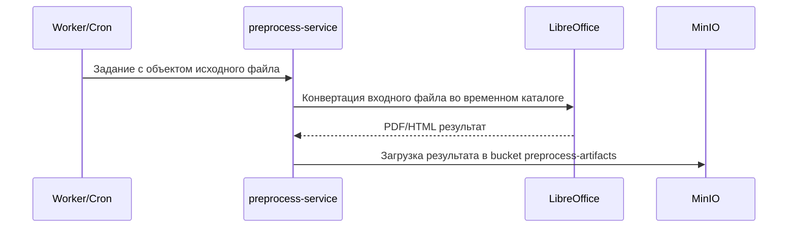

# Диаграммы сервиса

## Компоненты

```mermaid
flowchart LR
    Client[[Cron / gRPC клиент]] -->|отправка задания| HTTP[HTTP API / Health]
    HTTP --> App[App слой]
    App --> Domain[Domain]
    App --> Preprocess[LibreOffice Runner]
    Preprocess --> MinIO[(MinIO bucket preprocess-artifacts)]
```

## Поток предобработки (укороченный)

```mermaid
sequenceDiagram
    participant W as Worker/Cron
    participant P as preprocess-service
    participant L as LibreOffice
    participant M as MinIO

    W->>P: Задание с объектом исходного файла
    P->>L: Конвертация входного файла во временном каталоге
    L-->>P: PDF/HTML результат
    P->>M: Загрузка результата в bucket preprocess-artifacts
```
