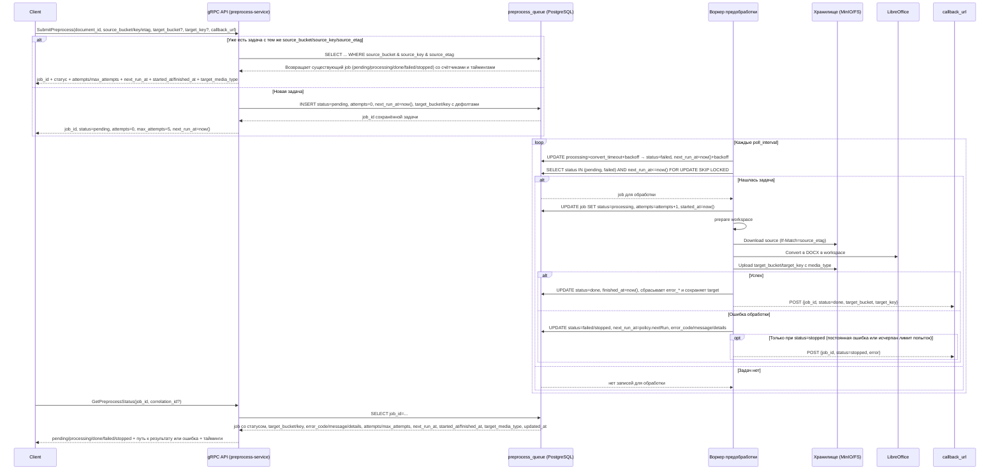

# Динамика постановки, обработки и обратного вызова

```mermaid
sequenceDiagram
    participant Client
    participant API as gRPC API (preprocess-service)
    participant Queue as preprocess_queue (PostgreSQL)
    participant Worker as Воркер предобработки
    participant Storage as Хранилище (MinIO/FS)
    participant Converter as LibreOffice
    participant Callback as callback_url

    Client->>API: SubmitPreprocess(document_id, source_bucket/key/etag, target_bucket?, target_key?, callback_url)
    alt Уже есть задача с тем же source_bucket/source_key/source_etag
        API->>Queue: SELECT ... WHERE source_bucket & source_key & source_etag
        Queue-->>API: Возвращает существующий job (pending/processing/done/failed/stopped) со счётчиками и таймингами
        API-->>Client: job_id + статус + attempts/max_attempts + next_run_at + started_at/finished_at + target_media_type
    else Новая задача
        API->>Queue: INSERT status=pending, attempts=0, next_run_at=now(), target_bucket/key с дефолтами
        Queue-->>API: job_id сохранённой задачи
        API-->>Client: job_id, status=pending, attempts=0, max_attempts=5, next_run_at=now()
    end

    loop Каждые poll_interval
        Worker->>Queue: UPDATE processing>convert_timeout+backoff → status=failed, next_run_at=now()+backoff
        Worker->>Queue: SELECT status IN (pending, failed) AND next_run_at<=now() FOR UPDATE SKIP LOCKED
        alt Нашлась задача
            Queue-->>Worker: job для обработки
            Worker->>Queue: UPDATE job SET status=processing, attempts=attempts+1, started_at=now()
            Worker->>Worker: prepare workspace
            Worker->>Storage: Download source (If-Match=source_etag)
            Worker->>Converter: Convert в DOCX в workspace
            Worker->>Storage: Upload target_bucket/target_key с media_type
            alt Успех
                Worker->>Queue: UPDATE status=done, finished_at=now(), сбрасывает error_* и сохраняет target
                Worker-->>Callback: POST {job_id, status=done, target_bucket, target_key}
            else Ошибка обработки
                Worker->>Queue: UPDATE status=failed/stopped, next_run_at=policy.nextRun, error_code/message/details
                opt Только при status=stopped (постоянная ошибка или исчерпан лимит попыток)
                    Worker-->>Callback: POST {job_id, status=stopped, error}
                end
            end
        else Задач нет
            Queue-->>Worker: нет записей для обработки
        end
    end

    Client->>API: GetPreprocessStatus(job_id, correlation_id?)
    API->>Queue: SELECT job_id=...
    Queue-->>API: job со статусом, target_bucket/key, error_code/message/details, attempts/max_attempts, next_run_at, started_at/finished_at, target_media_type, updated_at
    API-->>Client: pending/processing/done/failed/stopped + путь к результату или ошибка + тайминги
```
