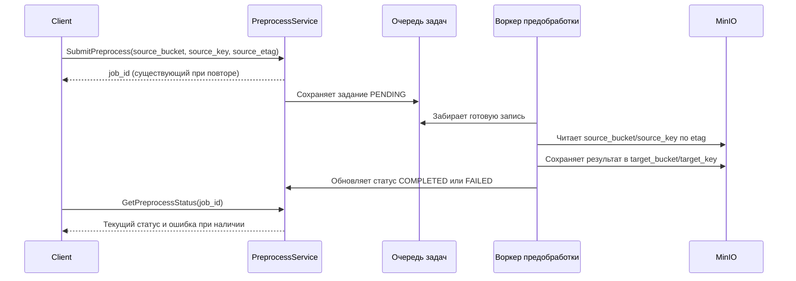

# Последовательность Submit → очередь → воркер → MinIO → статус

```mermaid
sequenceDiagram
    participant Client
    participant Preprocess as PreprocessService
    participant Queue as Очередь задач
    participant Worker as Воркер предобработки
    participant MinIO

    Client->>Preprocess: SubmitPreprocess(source_bucket, source_key, source_etag)
    Preprocess-->>Client: job_id (существующий при повторе)
    Preprocess->>Queue: Сохраняет задание PENDING
    Worker->>Queue: Забирает готовую запись
    Worker->>MinIO: Читает source_bucket/source_key по etag
    Worker->>MinIO: Сохраняет результат в target_bucket/target_key
    Worker->>Preprocess: Обновляет статус COMPLETED или FAILED
    Client->>Preprocess: GetPreprocessStatus(job_id)
    Preprocess-->>Client: Текущий статус и ошибка при наличии
```
