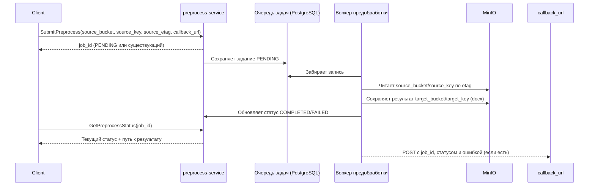

# Последовательность Submit → очередь → воркер → MinIO → callback

```mermaid
sequenceDiagram
    participant Client
    participant Preprocess as preprocess-service
    participant Queue as Очередь задач (PostgreSQL)
    participant Worker as Воркер предобработки
    participant MinIO
    participant Callback as callback_url

    Client->>Preprocess: SubmitPreprocess(source_bucket, source_key, source_etag, callback_url)
    Preprocess-->>Client: job_id (PENDING или существующий)
    Preprocess->>Queue: Сохраняет задание PENDING
    Worker->>Queue: Забирает запись
    Worker->>MinIO: Читает source_bucket/source_key по etag
    Worker->>MinIO: Сохраняет результат target_bucket/target_key (docx)
    Worker->>Preprocess: Обновляет статус COMPLETED/FAILED
    Client->>Preprocess: GetPreprocessStatus(job_id)
    Preprocess-->>Client: Текущий статус + путь к результату
    Worker-->>Callback: POST с job_id, статусом и ошибкой (если есть)
```
