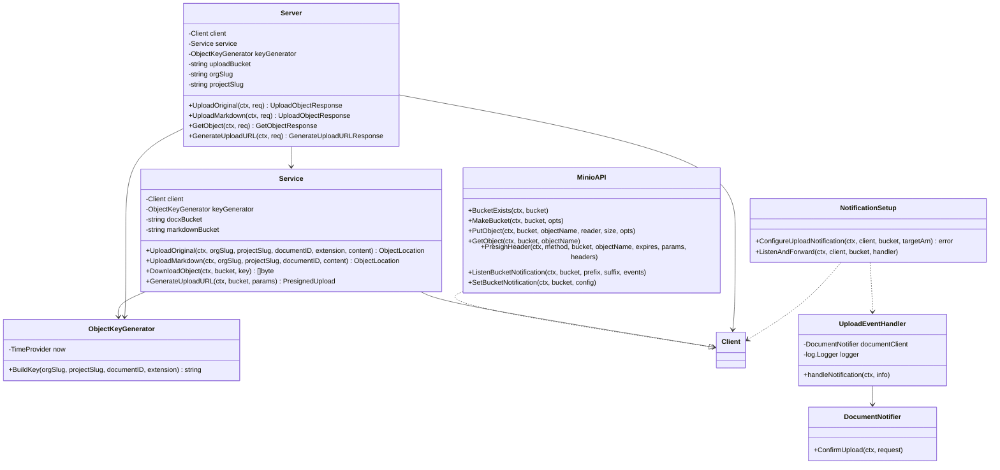

# Code / Module View

```mermaid
classDiagram
    class ObjectKeyGenerator {
        -TimeProvider now
        +BuildKey(orgSlug, projectSlug, documentID, extension) string
    }

    class Client
    class MinioAPI {
        +BucketExists(ctx, bucket)
        +MakeBucket(ctx, bucket, opts)
        +PutObject(ctx, bucket, objectName, reader, size, opts)
        +GetObject(ctx, bucket, objectName)
        +PresignHeader(ctx, method, bucket, objectName, expires, params, headers)
        +ListenBucketNotification(ctx, bucket, prefix, suffix, events)
        +SetBucketNotification(ctx, bucket, config)
    }
    MinioAPI ..|> Client

    class Service {
        -Client client
        -ObjectKeyGenerator keyGenerator
        -string docxBucket
        -string markdownBucket
        +UploadOriginal(ctx, orgSlug, projectSlug, documentID, extension, content) ObjectLocation
        +UploadMarkdown(ctx, orgSlug, projectSlug, documentID, content) ObjectLocation
        +DownloadObject(ctx, bucket, key) []byte
        +GenerateUploadURL(ctx, bucket, params) PresignedUpload
    }
    Service --> ObjectKeyGenerator
    Service --> Client

    class Server {
        -Client client
        -Service service
        -ObjectKeyGenerator keyGenerator
        -string uploadBucket
        -string orgSlug
        -string projectSlug
        +UploadOriginal(ctx, req) UploadObjectResponse
        +UploadMarkdown(ctx, req) UploadObjectResponse
        +GetObject(ctx, req) GetObjectResponse
        +GenerateUploadURL(ctx, req) GenerateUploadURLResponse
    }
    Server --> Service
    Server --> ObjectKeyGenerator
    Server --> Client

    class UploadEventHandler {
        -DocumentNotifier documentClient
        -log.Logger logger
        +handleNotification(ctx, info)
    }
    class DocumentNotifier {
        +ConfirmUpload(ctx, request)
    }
    class NotificationSetup {
        +ConfigureUploadNotification(ctx, client, bucket, targetArn) error
        +ListenAndForward(ctx, client, bucket, handler)
    }

    UploadEventHandler --> DocumentNotifier
    NotificationSetup ..> Client
    NotificationSetup ..> UploadEventHandler
```
