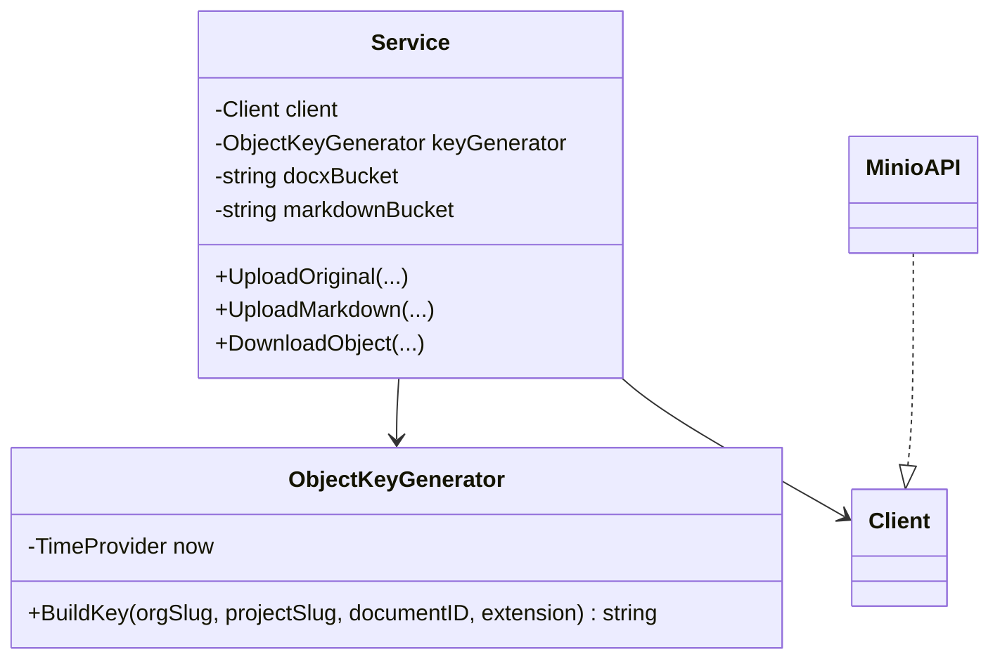

# Code / Module View

```mermaid
classDiagram
    class ObjectKeyGenerator {
        -TimeProvider now
        +BuildKey(orgSlug, projectSlug, documentID, extension) string
    }

    class Service {
        -Client client
        -ObjectKeyGenerator keyGenerator
        -string docxBucket
        -string markdownBucket
        +UploadOriginal(...)
        +UploadMarkdown(...)
        +DownloadObject(...)
    }

    class Client
    class MinioAPI

    Service --> ObjectKeyGenerator
    Service --> Client
    MinioAPI ..|> Client
```
