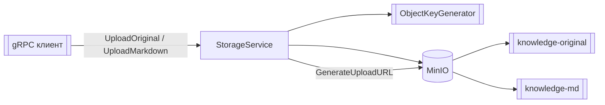
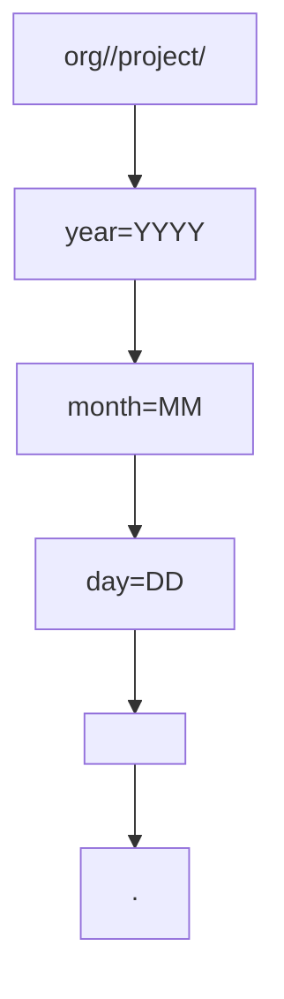

# Диаграммы

## Компонентная схема

```mermaid
flowchart LR
  Client[[gRPC клиент]] -->|UploadOriginal / UploadMarkdown| StorageService
  StorageService --> KeyGen[[ObjectKeyGenerator]]
  StorageService --> MinIO[(MinIO)]
  MinIO --> Bucket1[[knowledge-original]]
  MinIO --> Bucket2[[knowledge-md]]
  StorageService -->|GenerateUploadURL| MinIO
```

## Ключ

```mermaid
graph TD
  A[org/<org_slug>/project/<project_slug>] --> B[year=YYYY]
  B --> C[month=MM]
  C --> D[day=DD]
  D --> E[<uuid>]
  E --> F[<document_id>.<ext>]
```
