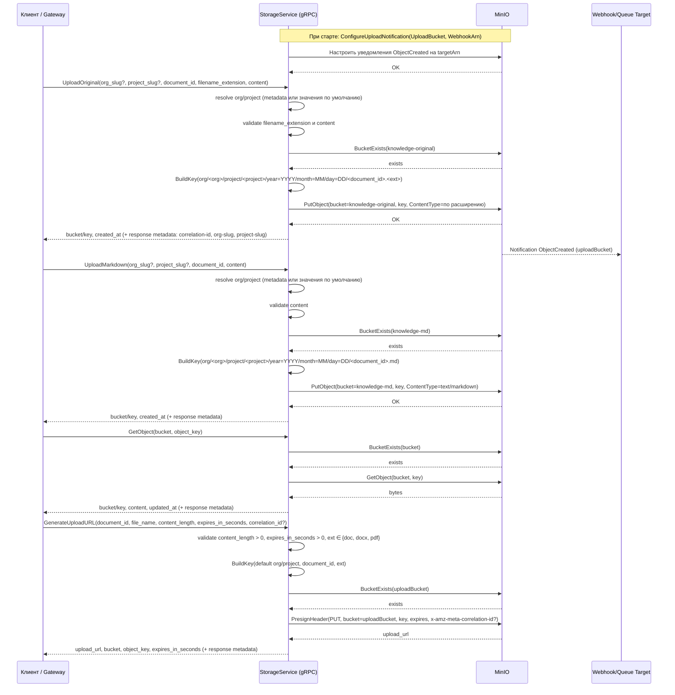

# Sequence diagram

```mermaid
sequenceDiagram
    participant Client as Клиент / Gateway
    participant Storage as StorageService (gRPC)
    participant MinIO
    participant Events as Webhook/Queue Target

    Note over Storage,MinIO: При старте: ConfigureUploadNotification(UploadBucket, WebhookArn)
    Storage->>MinIO: Настроить уведомления ObjectCreated на targetArn
    MinIO-->>Storage: OK

    %% UploadOriginal
    Client->>Storage: UploadOriginal(org_slug?, project_slug?, document_id, filename_extension, content)
    Storage->>Storage: resolve org/project (metadata или значения по умолчанию)
    Storage->>Storage: validate filename_extension и content
    Storage->>MinIO: BucketExists(knowledge-original)
    MinIO-->>Storage: exists
    Storage->>Storage: BuildKey(org/<org>/project/<project>/year=YYYY/month=MM/day=DD/<document_id>.<ext>)
    Storage->>MinIO: PutObject(bucket=knowledge-original, key, ContentType=по расширению)
    MinIO-->>Storage: OK
    Storage-->>Client: bucket/key, created_at (+ response metadata: correlation-id, org-slug, project-slug)
    MinIO-->>Events: Notification ObjectCreated (uploadBucket)

    %% UploadMarkdown
    Client->>Storage: UploadMarkdown(org_slug?, project_slug?, document_id, content)
    Storage->>Storage: resolve org/project (metadata или значения по умолчанию)
    Storage->>Storage: validate content
    Storage->>MinIO: BucketExists(knowledge-md)
    MinIO-->>Storage: exists
    Storage->>Storage: BuildKey(org/<org>/project/<project>/year=YYYY/month=MM/day=DD/<document_id>.md)
    Storage->>MinIO: PutObject(bucket=knowledge-md, key, ContentType=text/markdown)
    MinIO-->>Storage: OK
    Storage-->>Client: bucket/key, created_at (+ response metadata)

    %% GetObject
    Client->>Storage: GetObject(bucket, object_key)
    Storage->>MinIO: BucketExists(bucket)
    MinIO-->>Storage: exists
    Storage->>MinIO: GetObject(bucket, key)
    MinIO-->>Storage: bytes
    Storage-->>Client: bucket/key, content, updated_at (+ response metadata)

    %% GenerateUploadURL
    Client->>Storage: GenerateUploadURL(document_id, file_name, content_length, expires_in_seconds, correlation_id?)
    Storage->>Storage: validate content_length > 0, expires_in_seconds > 0, ext ∈ {doc, docx, pdf}
    Storage->>Storage: BuildKey(default org/project, document_id, ext)
    Storage->>MinIO: BucketExists(uploadBucket)
    MinIO-->>Storage: exists
    Storage->>MinIO: PresignHeader(PUT, bucket=uploadBucket, key, expires, x-amz-meta-correlation-id?)
    MinIO-->>Storage: upload_url
    Storage-->>Client: upload_url, bucket, object_key, expires_in_seconds (+ response metadata)
```
