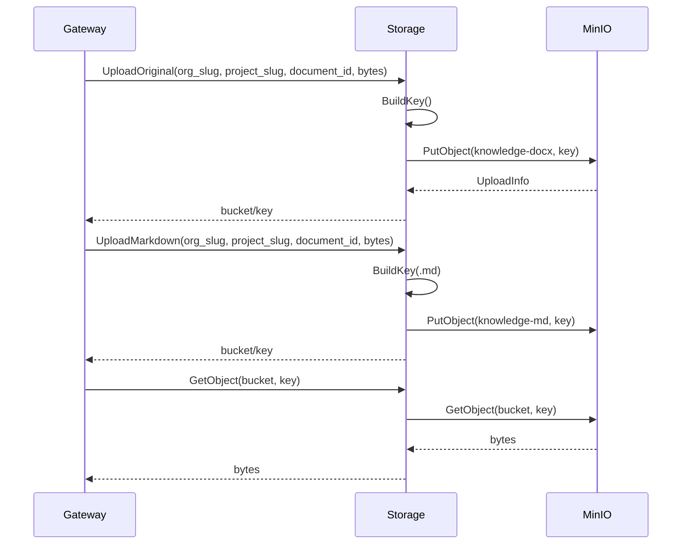

# Sequence diagram

```mermaid
sequenceDiagram
    participant Gateway
    participant Storage
    participant MinIO

    Gateway->>Storage: UploadOriginal(org_slug, project_slug, document_id, bytes)
    Storage->>Storage: BuildKey()
    Storage->>MinIO: PutObject(knowledge-docx, key)
    MinIO-->>Storage: UploadInfo
    Storage-->>Gateway: bucket/key

    Gateway->>Storage: UploadMarkdown(org_slug, project_slug, document_id, bytes)
    Storage->>Storage: BuildKey(.md)
    Storage->>MinIO: PutObject(knowledge-md, key)
    Storage-->>Gateway: bucket/key

    Gateway->>Storage: GetObject(bucket, key)
    Storage->>MinIO: GetObject(bucket, key)
    MinIO-->>Storage: bytes
    Storage-->>Gateway: bytes
```
