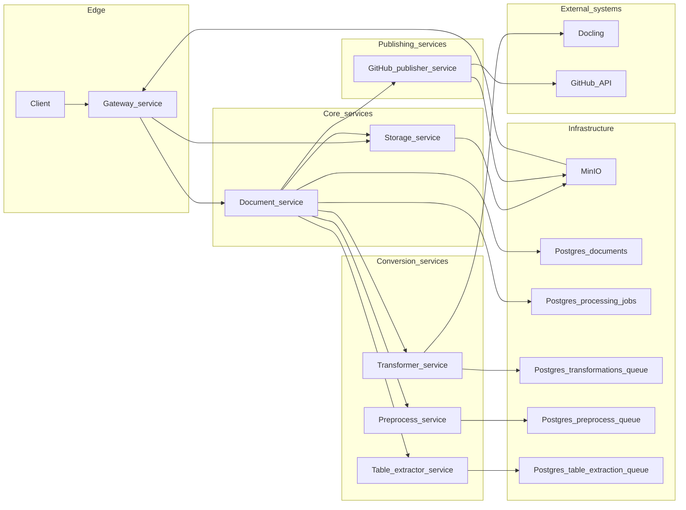
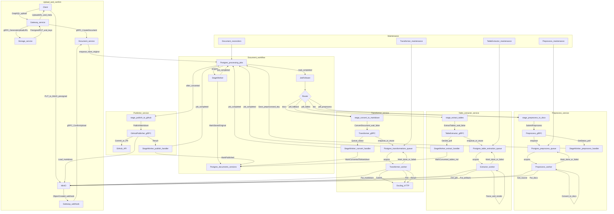

## Container/Component view

```mermaid
flowchart LR

subgraph Edge[Edge]
  CL[Client]
  GW[Gateway_service]
end

subgraph Core[Core_services]
  DS[Document_service]
  ST[Storage_service]
end

subgraph Convert[Conversion_services]
  TR[Transformer_service]
  PP[Preprocess_service]
  TE[Table_extractor_service]
end

subgraph Publish[Publishing_services]
  GP[GitHub_publisher_service]
end

subgraph Infra[Infrastructure]
  MN[MinIO]
  PGD[Postgres_documents]
  PGPJ[Postgres_processing_jobs]
  PGTR[Postgres_transformations_queue]
  PGPP[Postgres_preprocess_queue]
  PGTE[Postgres_table_extraction_queue]
end

subgraph External[External_systems]
  DL[Docling]
  GH[GitHub_API]
end

%% Edge to core
CL --> GW
GW --> DS
GW --> ST

%% Webhook path
MN --> GW

%% Document workflow and data
DS --> PGD
DS --> PGPJ

%% Storage
ST --> MN
DS --> ST

%% Stage calls
DS --> TR
DS --> PP
DS --> TE
DS --> GP

%% Per service queues
TR --> PGTR
PP --> PGPP
TE --> PGTE

%% External dependencies
TR --> DL
GP --> GH
GP --> MN

```

## Container/Component flow

```mermaid
flowchart TD

subgraph U[Upload_and_confirm]
  CL[Client] -->|GraphQL_upload| GW[Gateway_service]
  GW -->|gRPC_GenerateUploadURL| ST[Storage_service]
  ST -->|PresignedPUT_and_keys| GW
  GW -->|gRPC_CreateDocument| DS[Document_service]
  GW -->|UploadURL_and_meta| CL

  CL -->|PUT_to_MinIO_presigned| MN[MinIO]
  MN -->|ObjectCreated_webhook| WH[Gateway_webhook]
  WH -->|gRPC_ConfirmUpload| DS
end

subgraph W[Document_workflow]
  DS -->|enqueue_store_original| PJ[Postgres_processing_jobs]
  PJ -->|acquire| SW[StageWorker]
  SW -->|MarkStoredOriginal| DOCDB[Postgres_documents_versions]
  SW -->|job_completed| PJ
  PJ -->|read_completed| JF[JobFollower]
  JF --> R{Router}
end

R -->|docx| C2M[stage_convert_to_markdown]
R -->|doc| P2D[stage_preprocess_to_docx]
R -->|pdf_tables| ET[stage_extract_tables]
R -->|pdf_preprocess| P2D
R -->|pdf_fallback| C2M

subgraph P[Preprocess_service]
  P2D -->|SubmitPreprocess| PPGRPC[Preprocess_gRPC]
  PPGRPC -->|enqueue| PPQ[Postgres_preprocess_queue]
  PPQ -->|acquire| PPW[Preprocess_worker]
  PPW -->|Get_source| MN
  PPW -->|Convert_to_docx| PPW
  PPW -->|Put_docx| MN
  PPW -->|Mark_done_or_failed| PPQ
  PPGRPC -->|GetStatus_poll| SWP[StageWorker_preprocess_handler]
  SWP -->|Save_preprocessed_key| PJ
end

subgraph T[Transformer_service]
  C2M -->|ConvertDocument_wait_false| TRGRPC[Transformer_gRPC]
  TRGRPC -->|enqueue_or_reuse| TRQ[Postgres_transformations_queue]
  TRQ -->|acquire| TRW[Transformer_worker]
  TRW -->|Submit| DL[Docling_HTTP]
  TRW -->|Poll| DL
  TRW -->|Result| DL
  TRW -->|Put_markdown| MN
  TRW -->|Mark_done_or_failed| TRQ
  TRGRPC -->|Queue_status| SWT[StageWorker_convert_handler]
  SWT -->|MarkConvertedToMarkdown| DOCDB
  SWT -->|job_completed| PJ
end

subgraph E[Table_extractor_service]
  ET -->|ExtractTables_wait_false| TEGRPC[TableExtractor_gRPC]
  TEGRPC -->|enqueue_or_reuse| TEQ[Postgres_table_extraction_queue]
  TEQ -->|acquire| TEW[Extractor_worker]
  TEW -->|Get_pdf| MN
  TEW -->|Pdfinfo| TEW
  TEW -->|Pdftotext| TEW
  TEW -->|Pdftoppm| TEW
  TEW -->|Parse_and_render| TEW
  TEW -->|Put_artifacts| MN
  TEW -->|Mark_done_or_failed| TEQ
  TEGRPC -->|GetJob_poll| SWE[StageWorker_extract_handler]
  SWE -->|MarkConverted_tables_md| DOCDB
  SWE -->|job_completed| PJ
end

subgraph G[Publisher_service]
  PJ -->|after_converted| PUB[stage_publish_to_github]
  PUB -->|PublishMarkdown| GPGRPC[GitHubPublisher_gRPC]
  GPGRPC -->|Load_markdown| MN
  GPGRPC -->|Commit_or_PR| GH[GitHub_API]
  GPGRPC -->|Result| SWG[StageWorker_publish_handler]
  SWG -->|MarkPublished| DOCDB
  SWG -->|job_completed| PJ
end

subgraph M[Maintenance]
  TRM[Transformer_maintenance] --> TRQ
  PPM[Preprocess_maintenance] --> PPQ
  TEM[TableExtractor_maintenance] --> TEQ
  DSM[Document_reconcilers] --> PJ
end

```