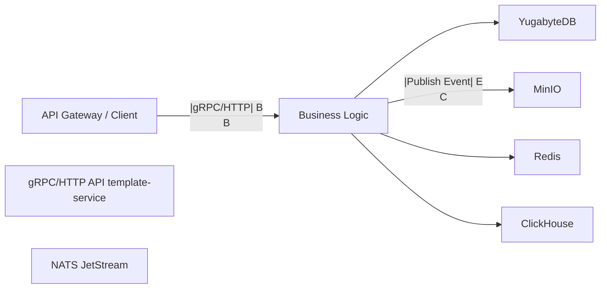
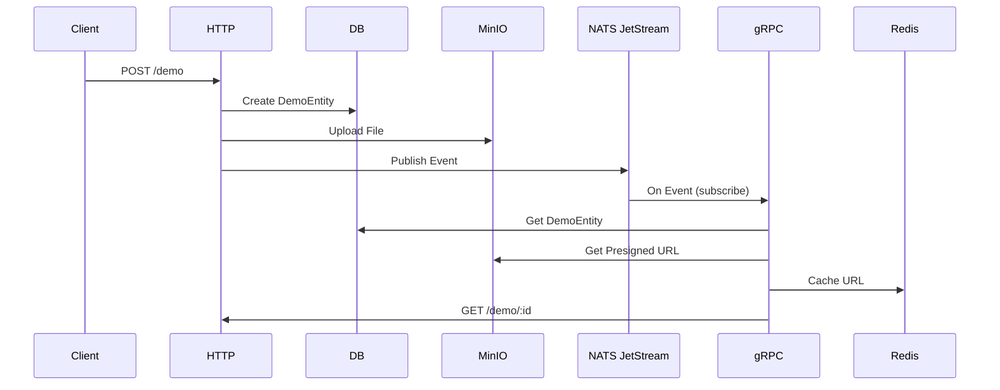

# Диаграммы (Mermaid)

## Диаграмма архитектуры

```mermaid
graph LR
    A[API Gateway / Client]
    B[gRPC/HTTP API template-service]
    C[Business Logic]
    D[YugabyteDB]
    E[NATS JetStream]
    F[MinIO]
    G[Redis]
    H[ClickHouse]

    A --|gRPC/HTTP| B
    B --> C
    C --> D
    C --|Publish Event| E
    C --> F
    C --> G
    C --> H
```

## Event Loop (DemoEntity)

```mermaid
sequenceDiagram
    participant Client
    participant HTTP
    participant DB
    participant MinIO
    participant NATS JetStream
    participant gRPC
    participant Redis

    Client->>HTTP: POST /demo
    HTTP->>DB: Create DemoEntity
    HTTP->>MinIO: Upload File
    HTTP->>NATS JetStream: Publish Event
    NATS JetStream->>gRPC: On Event (subscribe)
    gRPC->>DB: Get DemoEntity
    gRPC->>MinIO: Get Presigned URL
    gRPC->>Redis: Cache URL
    gRPC->>HTTP: GET /demo/:id
```
