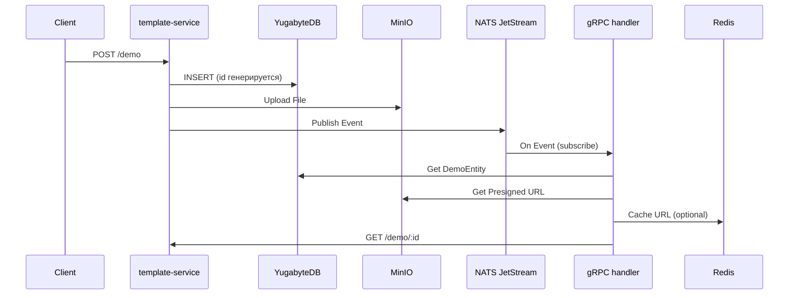

# Flows

## Последовательность создания DemoEntity (event-driven)

```mermaid
sequenceDiagram
    participant C as Client
    participant API as template-service
    participant DB as YugabyteDB
    participant MINIO as MinIO
    participant NATS as NATS JetStream
    participant GRPC as gRPC handler
    participant REDIS as Redis

    C->>API: POST /demo
    API->>DB: INSERT (id генерируется)
    API->>MINIO: Upload File
    API->>NATS: Publish Event
    NATS->>GRPC: On Event (subscribe)
    GRPC->>DB: Get DemoEntity
    GRPC->>MINIO: Get Presigned URL
    GRPC->>REDIS: Cache URL (optional)
    GRPC->>API: GET /demo/:id
```
